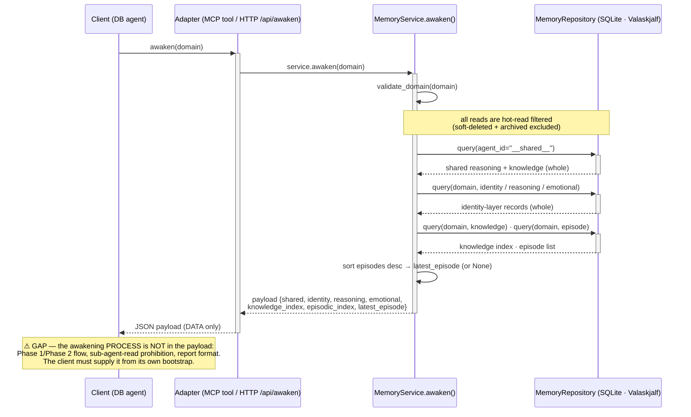

# Flow: Awaken (DB payload consumption)

**Trigger**: A DB/Munnin client awakens an agent — MCP `awaken(domain)` tool call, or its HTTP twin `GET /api/awaken?agent_id={domain}`.
**Type**: `sequenceDiagram` — the flow is a multi-participant request/response over time (client → adapter → service → repository → store), which the sequence grammar captures best.
**Participants**: Client (a DB-world agent), MCP/HTTP adapter ([api_mcp/server.py](../../src/munnin/api_mcp/server.py) `awaken` tool · [api_http/api.py](../../src/munnin/api_http/api.py) `/api/awaken`), [MemoryService](../../src/munnin/business_services/memory_service.py) `awaken()`, [MemoryRepository](../../src/munnin/data_repositories/memory_repository.py) → SQLite (Valaskjalf `memory.db`).

---

## Diagram

## Steps

1. **Entry** — client calls `awaken(domain)`. MCP: [`awaken` tool](../../src/munnin/api_mcp/server.py) (`server.py:27`). HTTP twin: [`GET /api/awaken`](../../src/munnin/api_http/api.py) (`api.py:47`). Both delegate straight to `service.awaken(domain)`.
2. **Validate** — `MemoryService.awaken()` (`memory_service.py:77`) runs `validate_domain(domain)` (kebab domain; `__shared__` is not a valid awaken target).
3. **Layer i — shared always-load** — `repo.query(agent_id="__shared__")`, split into `reasoning` + `knowledge`, each projected **whole** (full body).
4. **Layer ii — agent identity** — three `repo.query(domain, …)` calls for `identity` / `reasoning` / `emotional`, projected **whole**.
5. **Layer iii — indexes** — `repo.query(domain, knowledge)` → `_index` (metadata only) and `repo.query(domain, episode)` sorted `created_date desc, id desc` → `episodic_index`; `latest_episode` = `episodes[0]` projected **whole** (or `None` when the agent has no episodes).
6. **Assemble + return** — service returns the payload dict; the adapter serializes it to the client as JSON.
7. **Client processing** — the client renders the 4 layers into working memory. **This is where the gap lives** (see below).

## Preconditions & Notes

- **Preconditions**: the DB was populated by the [importer](../../src/munnin/data_migrations/importer.py) (markdown → records) or by live `insert`s; the `control-files` submodule is *not* needed for `awaken` (it's only needed for served Prompts/Resources).
- **Branches**: `latest_episode` is `None` when the agent has zero episodes (the only branch — no `alt` needed). Deleted + archived rows are excluded at the repository (hot-read), so no filtering branch surfaces in the service.
- **External dependency**: SQLite (`data/valaskjalf-memory.db`). The trace stops at the repository boundary.
- **⚠ Process-instruction gap (the reason this doc exists — `[CONFIRM]` intentional-vs-close):**
  - The payload from `MemoryService.awaken()` carries **data only** — the 4 memory layers. It contains **no awakening *process***: the Phase 1 → Phase 2 protocol, the "don't delegate awakening reads to a sub-agent" rule, and the consolidated report format all live in [awaken-agent.md](../../control-files/procedures/awaken-agent.md) + `core-instruction-control-files.md`.
  - Confirmed by code: the [importer](../../src/munnin/data_migrations/importer.py) imports `__shared__` reasoning/knowledge + per-agent identity/reasoning/emotional/knowledge/episodes — it **never** imports `core-instruction-control-files.md` or `awaken-agent.md`. Neither is a DB record, and neither is served ([awaken-agent is intentionally excluded from the served Prompts](../../src/munnin/content/loader.py)).
  - **Asymmetry vs the markdown fleet**: in the markdown pathway, [awaken-agent.md](../../control-files/procedures/awaken-agent.md) carries **both** the read mechanics *and* the process. In the DB pathway, the `awaken` tool carries the data; the process has no server-side home.
  - **Open decision**: is this intentional (the client's bootstrap owns the awakening process — arguably correct, since "how to process your identity" is client behavior, not stored memory) or a gap to close (e.g. serve the awakening protocol as an MCP Prompt, or add a bootstrap section to the `awaken` payload)?

## Related

- [awaken-agent.md](../../control-files/procedures/awaken-agent.md) — the markdown-pathway awakening procedure (carries data reads *and* process).
- [control-files/docs/flows/awaken-agent.md](../../control-files/docs/flows/awaken-agent.md) — the markdown-pathway awaken flow doc (sibling to this one).
- [loader.py](../../src/munnin/content/loader.py) — the served-content seam; documents why `awaken-agent` + push/pull/refresh are not served.
- ADR-013 (`shared-memory/agent-memory/context/…` / central `docs/adr/2026-08-08-memory-server-db-and-store-ownership.md`) — the DB/transport model this flow realizes.
