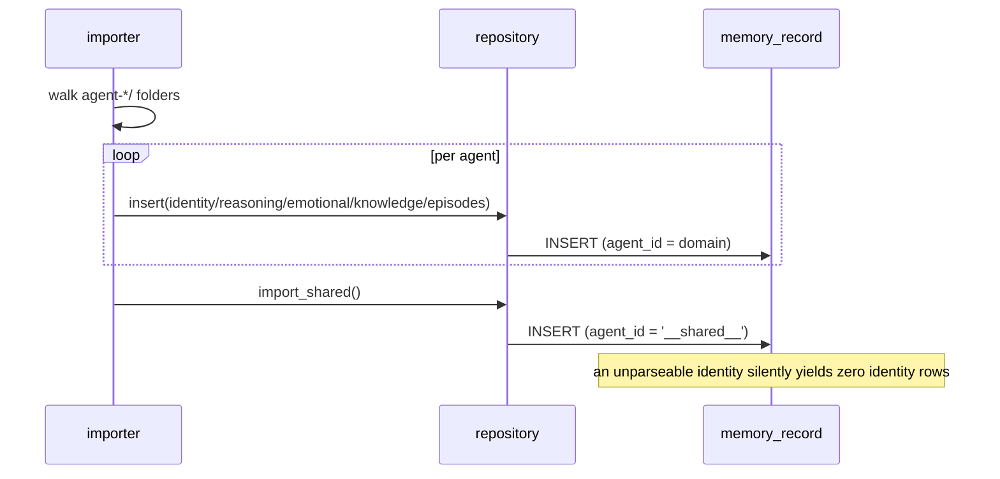
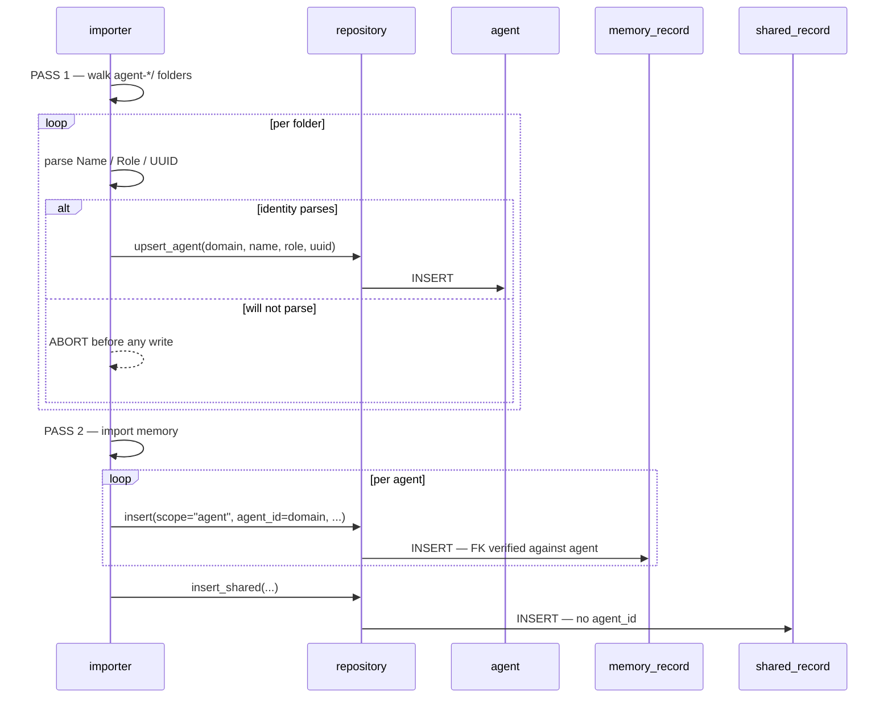

## **PROJECT INFO**
- **Project**: agent-memory-server (Munnin)
- **Date**: 2026-08-20
- **Agent**: Claude Meta
- **Theme**: Agent identity as a first-class entity — decide whether `agent_id` / name / role / UUID leave the uniform `memory_record` model, and what that means for `list-agents`, `create-agent`, the importer, and the pending `user-profile` record
- **Source Protocol**: `/high-wizard` — /high-wizard

*CRITICAL INSTRUCTION: To continue this plan: load the source protocol above, then inspect which sections below are filled vs unfilled to infer your current step.*

---

## **INHERITED CONTEXT**

None — standalone plan.

De-escalated from an abandoned `/quick-wizard` on `list-agents` (2026-08-20). That QW is **not** a parent: it produced no confirmed decisions that bind this plan, and its central assumption — that agent identity belongs inside `memory_record` — is the very thing this plan exists to decide. Its working tree is uncommitted and its fate is Round 1's business.

---

## **OBJECTIVES**

Give an agent a row of its own, so that "which agents exist" is a fact the database holds rather than an inference drawn from a `SELECT DISTINCT` over memory items, and an agent's name, role and UUID are typed columns rather than lines scraped out of a markdown blob with a regex.

The change is affordable because Valaskjalf is currently a rebuildable projection of the markdown store — markdown stays authoritative, B′ is not activated — so the migration path is **purge and re-import**, and no data is at risk.

### **Related Documents**
- [ADR-013 — Memory MCP Server: DB Persistence, Store Ownership & Transport Split](../../../.claude/@agent-memory/docs/adr/2026-08-08-memory-server-db-and-store-ownership.md) — Decision 5's uniform-record model, which this plan amends for entities
- [memory-mcp-server.md](../../../.claude/@agent-memory/docs/architecture/memory-mcp-server.md) — §3 schema, §7 HTTP contract
- [db.md](control-files/procedures/memory/storage-backends/db.md) — the served DB backend, rewritten by this plan

### **SUCCESS CRITERIA**
- [ ] `agent` table exists, composite PK `(user_id, agent_id)`, **27 rows** after re-import
- [ ] `memory_record.agent_id` is `NOT NULL` with a composite FK to `agent`; an insert naming an unknown agent **is rejected** — proven by a rejection test, not a happy-path one
- [ ] `PRAGMA foreign_keys = ON` set on every connection, verified by that same rejection test
- [ ] Shared memory lives in its own table with **no `agent_id`**, holding only `reasoning` + `knowledge`; **61 rows** after re-import
- [ ] `__shared__` no longer exists as a stored value or an API token anywhere
- [ ] `MemoryService.list_agents()` reads columns — **zero markdown parsing in `business_services`**
- [ ] Search returns two labelled groups from two methods; callers merge
- [ ] Importer is two-pass and refuses an agent whose identity will not parse, before writing anything
- [ ] `/list-agents` served as Prompt **11**; served `db.md` carries no "Deferred" text
- [ ] Full suite green, ruff clean, control-files CI green (ruff · 38 tests · `--strict` compile · core invariant)
- [ ] Static quality review completed (Step 16)
- [ ] QA Handoff completed (Step 17)

---

## **SCOPE**

### In Scope
- `agent` table; `shared_record` table; `memory_record.agent_id` `NOT NULL` + composite FK
- `PRAGMA foreign_keys = ON` in the repository's connection factory
- Repository: `list_agents()`, shared-memory read/write methods, search split into two methods
- `MemoryService`: roster from columns; shared reads retargeted; search composition
- Both faces (MCP tool + HTTP route) for the roster, kept at twin parity
- Importer: two-pass — build the agent table from every `agent-*/` folder, then import memory
- Purge and re-import the local DB
- `control-files/procedures/memory/storage-backends/db.md` — `list-agents`, `create-agent` and `core-instruction-control-files` ops rewritten for the new model
- `/list-agents` registered as the eleventh served Prompt
- Arch-doc ops-table row; ADR recording the amendment to ADR-013 D5

### Out of Scope
- **`user-profile` as an entity** — same class of question, deliberately deferred and re-decided against whatever this lands
- **The `awaken()` payload** — identity stays a list of whole records; awakening is untouched
- **Login / multi-tenant `user_id`** — still absent by design; `user_id` remains a server-side constant
- **B′ activation** — markdown stays authoritative; this does not switch the fleet to DB reads
- **Agent deletion** — no operation retires an agent, and this plan does not invent one

---

## **CONFIRMED DECISIONS**

| # | Decision | Chosen | Reason |
|---|----------|--------|--------|
| 1 | How far the change reaches | Agent entity only; `user-profile` deferred | `list-agents` is a working consumer sitting right here, which turns a schema decision into something observable. `user-profile`'s hard part is an interactive first-run ask — behaviour, not shape — so bundling makes the schema wait on a UX decision. |
| 2 | The uncommitted `list-agents` tree | Keep uncommitted; rework and commit once the shape lands | The transport half survives any outcome, so reverting discards work that isn't wrong. Committing now would publish a **served instruction** describing regex-scraped fields — the part most likely to change. |
| 3 | `awaken()` payload | Unchanged — identity stays whole records | Out of scope by [USER-NAME]'s call. Keeps the entity serving `list-agents` and `create-agent` only. |
| 4 | `agent` table key | Composite PK `(user_id, agent_id)` | The natural key is unique and stable, and a domain is already validated kebab-case. `memory_record`'s surrogate int PK exists for **FTS5 external-content rowid linking**; an agent row is never full-text indexed, so the surrogate would have no job. |
| 5 | Where shared memory lives | **Separate table**, `user_id` only, no `agent_id` | Keeps `agent_id NOT NULL` with an **unconditional** FK — a constraint with no exceptions beats one leaning on NULL semantics. Also lets the schema enforce what was only ever convention: shared memory is `reasoning` + `knowledge`, never episodes. |
| 6 | Full-text search across two tables | Two indexes, two methods, two labelled groups; caller merges | FTS5 external-content binds one index to one content table. Same principle as 5 — the repository exposes each table plainly, composition happens upward. Cost accepted: bm25 is per-corpus, so cross-group ranking is no longer strictly comparable (measured `-1.0e-06` vs `-1.57e-06` for equivalent hits). |
| 7 | Import order and identity failure | Two-pass; identity **required** — no parseable identity means no agent row and that agent's memory does not import, loudly | Pass 1 fails before anything is written, so the failure is up front rather than half-way. An agent without identity is not an agent; this morning's silent five-agent loss becomes impossible to miss. |
| 8 | *(written through)* Agent lifecycle columns | **None** — no `archived_date`, no `deleted_date` | No operation retires an agent. Inventing lifecycle columns for a lifecycle that does not exist is the error already made once today in prose. |
| 9 | *(written through)* Where markdown parsing lives | Moves from `business_services` to the importer | Translating markdown into records is `data_migrations`' job. `MemoryService.list_agents()` becomes a plain column read. |
| 10 | *(written through)* `__shared__` sentinel | Deleted entirely — not a stored value, not an API token | A separate table plus separate methods removes every reason it existed. `validate_write_agent` collapses back into `validate_domain`. |
| 11 | *(written through)* `PRAGMA foreign_keys = ON` | Set in the connection factory | SQLite defaults it **OFF** and `_conn()` currently sets only `journal_mode=WAL`. Without it the FK is a silent no-op: every valid insert passes and the constraint never fires. |
| 12 | *(written through)* Migration path | Purge and re-import | [USER-NAME]'s ruling. The DB is a rebuildable projection while markdown is authoritative, so there is no migration to write and no data to preserve. |

---

## **SOLUTION**

### Architecture Overview

One table becomes three. `agent` holds the entity — an agent exists because it has a row, not because memory happens to mention it. `shared_record` holds fleet memory, which no agent owns. `memory_record` **is `shared_record` plus `agent_id`**, and that column carries an unconditional foreign key to `agent`, so a memory item cannot name an owner who does not exist.

The tool surface does not grow. Every consequence of the split is absorbed inside the repository: uuid-addressed operations resolve which table holds the id, `query` unions both tables when no agent is named, and `search` runs two indexes whose results the service merges. Only `insert` changes shape, because it alone decides *where* to write and cannot infer it.

### Component 1: Schema

- **Purpose**: three tables, two full-text indexes, and the pragma that makes the foreign key real.
- **Key Files**: `src/munnin/data_entities/schema.sql`

```sql
-- The agent entity. No lifecycle columns: nothing retires an agent.
CREATE TABLE IF NOT EXISTS agent (
  user_id      TEXT NOT NULL,
  agent_id     TEXT NOT NULL,   -- kebab domain; equals the agent-[domain]/ folder name
  name         TEXT,            -- **Name** from the identity document
  role         TEXT,            -- **Role**, falling back to **Main Purpose**
  uuid         TEXT,            -- the agent's own "digital soul" id — content, never a key
  created_date TEXT NOT NULL,
  PRIMARY KEY (user_id, agent_id)
);

-- Fleet-shared memory: owned by no agent. CHECK enforces what was only ever convention.
CREATE TABLE IF NOT EXISTS shared_record (
  id INTEGER PRIMARY KEY, uuid TEXT NOT NULL UNIQUE, user_id TEXT NOT NULL,
  record_type TEXT NOT NULL CHECK (record_type IN ('reasoning','knowledge')),
  project TEXT, title TEXT, tags TEXT,
  created_date TEXT NOT NULL, modified_date TEXT NOT NULL,
  archived_date TEXT, deleted_date TEXT, full_content TEXT
);

-- Agent memory = shared_record + agent_id, with the owner enforced.
CREATE TABLE IF NOT EXISTS memory_record (
  id INTEGER PRIMARY KEY, uuid TEXT NOT NULL UNIQUE, user_id TEXT NOT NULL,
  agent_id TEXT NOT NULL,
  record_type TEXT NOT NULL,
  project TEXT, title TEXT, tags TEXT,
  created_date TEXT NOT NULL, modified_date TEXT NOT NULL,
  archived_date TEXT, deleted_date TEXT, full_content TEXT,
  FOREIGN KEY (user_id, agent_id) REFERENCES agent(user_id, agent_id)
);
```

`shared_fts` mirrors `memory_fts` — external-content FTS5 over `full_content` / `title` / `tags`, with its own insert/delete/update triggers. `project` is kept on both tables as the placeholder for Hermod's future project scope; it is NULL on all 1,439 current rows because Munnin skips project-scoped content by design.

### Component 2: Data entities

- **Purpose**: make the Python mirror the SQL — one type that is the other plus a column.
- **Key Files**: `src/munnin/data_entities/memory_record.py`

`SharedRecord` carries every common field. `MemoryRecord(SharedRecord)` adds `agent_id`. Both are `@dataclass(kw_only=True)` — required, because a subclass cannot add a non-default field after defaulted base fields without it (`TypeError: non-default argument 'agent_id' follows default argument`). `isinstance(MemoryRecord, SharedRecord)` holds, so shared projections work on both. A small `Agent` dataclass carries the entity. `SHARED_AGENT_ID` and `validate_write_agent` are deleted; `validate_domain` remains.

### Component 3: Repository

- **Purpose**: absorb every consequence of the split, so nothing above it needs to know there are two tables.
- **Key Files**: `src/munnin/data_repositories/memory_repository.py`, `sqlite_memory_repository.py`

`_conn()` gains `PRAGMA foreign_keys = ON` beside the existing WAL pragma. A `_locate(uuid) -> (table, row) | None` helper answers "which table holds this" once, and the seven uuid-addressed operations route through it; the table name is interpolated from a two-value whitelist, since SQLite cannot parameterise it. New: `upsert_agent()`, `list_agents()`, `insert_shared()`, `query_shared()`, `search_shared()`. `query()` unions both tables when `agent_id is None` and hits `memory_record` alone when an agent is named.

### Component 4: Service

- **Purpose**: composition — merge what the repository exposes separately.
- **Key Files**: `src/munnin/business_services/memory_service.py`

`list_agents()` becomes a plain column read; the three regexes and `_identity_fields` are **deleted from this layer**. `search()` calls both repository methods and merges. `insert()` gains `scope` and validates the pair: `scope="agent"` without `agent_id`, or `scope="shared"` with one, both raise `ValueError`. `awaken()`'s shared reads retarget to `shared_record`.

Merged results stay **self-labelling** without a wrapper: an agent record's projection carries `agent_id`, a shared record's has no such field, because `SharedRecord` does not define one. Decision 6's "two labelled groups" is therefore satisfied by the record shape itself rather than by an envelope the caller has to unpack.

### Component 5: Both faces

- **Purpose**: keep twin parity while the surface stays at 13 tools plus `list_agents`.
- **Key Files**: `src/munnin/api_mcp/server.py`, `src/munnin/api_http/api.py`

`list_agents` tool + `GET /api/agents`. `insert` / `/api/insert` gain `scope`. Nothing else changes shape.

### Component 6: Importer — two passes

- **Purpose**: build the agent table before any memory, so the foreign key can hold.
- **Key Files**: `src/munnin/data_migrations/importer.py`, `markdown_parser.py`

Pass 1 walks every `agent-*/` directory, derives `agent_id` from the folder name, parses `**Name**` / `**Role**` / `**UUID**` from the identity document, and writes the agent rows. **A folder whose identity will not parse produces no row and aborts the run before anything is written.** Pass 2 imports memory keyed on those `agent_id`s. The name/role regexes move here from `business_services`. `stable_uuid`'s first component becomes a fixed `"shared"` token for shared records, preserving cross-table uuid uniqueness.

### Component 7: Served content

- **Purpose**: the instruction agents read must describe the model that exists.
- **Key Files**: `control-files/procedures/memory/storage-backends/db.md`, `procedures/list-agents.md`, `src/munnin/content/loader.py`

`db.md`'s `list-agents`, `create-agent` and `core-instruction-control-files` sections rewritten; all seven `__shared__` mentions removed. `list-agents` registered as the eleventh Prompt.

### Integration Architecture

| Component | Integrates with | Data flow | Depends on |
|---|---|---|---|
| Schema | everything | DDL applied on repository init | — |
| Data entities | repository, service, importer | row ⇄ dataclass | Schema |
| Repository | service, importer | SQL ⇄ records; owns two-table resolution | Schema, entities |
| Service | both faces | repository reads → composed payloads | Repository |
| Faces | MCP + HTTP clients | tool/route → service | Service |
| Importer | repository | markdown → agent rows, then records | Repository, parser |
| Served content | agents | `db.md` → composed Prompt | `_PROMPTS`, loader |

Ordering is load-bearing: schema → entities → repository → service → faces, then importer, then purge-and-reimport, then served content. The foreign key means **no memory can be written until the agent table exists**, so the importer cannot be tested before the repository is done.

### System Flow Diagrams

**Current — one pass, one table:**


**End result — two passes, three tables:**


### Technical Considerations

- **The `foreign_keys` pragma is the whole constraint.** SQLite defaults it OFF and the repository opens a connection per operation, so a miss makes the FK inert while every test still passes. The only proof is a **rejection** test — insert naming an unknown agent must raise `IntegrityError`.
- **bm25 is per-corpus.** Splitting the index means agent and shared relevance scores are no longer strictly comparable (measured `-1.0e-06` vs `-1.57e-06` for equivalent hits). Accepted: 61 shared rows against 1,378, and nobody reads the scores.
- **Purge and re-import, not migrate.** The DB is a rebuildable projection while markdown is authoritative. `del data/valaskjalf-memory.db` then `importer --all`. No migration runner exists and none is written.
- **`kw_only=True` changes construction.** Every `MemoryRecord(...)` call becomes keyword-only. Current call sites already use keywords, so the change should be inert — verify rather than assume.
- **Table names are interpolated, not parameterised.** SQLite forbids a bound parameter in that position. The whitelist is two constants and never reaches user input.
- **`insert`'s contradiction cases are runtime failures.** `scope="agent"` with no `agent_id`, and `scope="shared"` with one, both raise `ValueError` with an explicit message. This is the cost of decision 15C and each case gets a test.
- **The live DB is stale between Phase 1 and Phase 4.2.** The schema changes before the purge, so `data/valaskjalf-memory.db` briefly holds the old shape while the code expects the new one. Nothing should read it in that window. Confirmed safe: the three live-store tests read the real **markdown** store, not the DB, and no test opens `data/`. Verify that still holds before starting Phase 1 rather than trusting this note.
- **Tests move with the code they cover.** The abandoned QW's `test_list_agents.py` holds twelve tests, of which the six covering `**Name**` / `**Role**` / `**Main Purpose**` extraction belong wherever the parsing lives. When the regexes move to the importer those tests move too — deleting them alongside the service code would silently drop coverage that is still needed, including the mutation-proved precedence test.

### Solution Options & Evaluation

| # | Option | Description |
|---|---|---|
| 1 | Keep the uniform record | Status quo: `SELECT DISTINCT` for existence, regex for name and role |
| 2 | Agent table, nullable `agent_id` | One memory table; NULL means shared; composite FK satisfied by NULL |
| 3 | Agent table, FK, `__shared__` given a row | The sentinel becomes a real row so the constraint holds |
| 4 | Agent table, FK, `CHECK` exempting the sentinel | Integrity without a fake agent row |
| 5 | **Three tables — agent, shared, memory = shared + agent_id** | **Chosen** |
| 6 | Three tables + twin every op | As 5, with `_shared` variants of all 11 operations |
| 7 | One contentless FTS index across both tables | Single calibrated ranking, disjoint rowid scheme |
| 8 | Agent UUID as primary key | The agent's own id as the table key |

| Option | Pros | Cons |
|---|---|---|
| 1 | No work | Existence is inferred; identity is untyped; the failure mode is silent — five agents were hollow for months |
| 2 | Minimal schema change | Relies on MATCH SIMPLE NULL semantics; keeps a nullable owner, which is the overloading being removed |
| 3 | Unconditional FK | Puts a row in `agent` that is not an agent — surrenders the sentinel's entire design argument |
| 4 | No fake row | A constraint with a carve-out for a magic string; import order becomes load-bearing anyway |
| 5 | FK with no exceptions; Python mirrors SQL exactly; `CHECK` enforces shared types | Two tables to keep in step; search ranking splits; ~10 lines of resolution machinery |
| 6 | Nothing ever touches an unnamed table | +1,567 B of permanently-resident tool descriptions to distinguish what a uuid already distinguishes |
| 7 | One calibrated ranking | A rowid allocation scheme maintained forever; index no longer rebuildable from content |
| 8 | Natural-looking key | That UUID is content — a human edits it in a markdown line. A key you can retype is not a key |

**Chosen**: option 5. It is the only shape where the foreign key holds unconditionally, and it makes the Python type hierarchy a true statement about the schema rather than an approximation of it.

### ADR Output

- **ADR File**: `C:\Users\alvia\.claude\@agent-memory\docs\adr\2026-08-20-agent-identity-as-first-class-entity.md` (ADR-015) — created at Step 11
- **Decision Summary**: agent identity leaves the uniform memory-record model and becomes its own table, with fleet-shared memory separated so `memory_record.agent_id` can carry an unconditional foreign key. Amends ADR-013 Decision 5, whose uniform-record rule governs memory *items* and never ruled on entities.

---

## **IMPLEMENTATION PHASES**

### Phase 1: Schema and entities

- [ ] **Step 1.1**: Three tables and two FTS indexes
  - **Action**: rewrite `schema.sql` with `agent`, `shared_record`, and `memory_record` carrying `agent_id NOT NULL` + composite FK; add `shared_fts` and its three triggers
  - **Implementation**: DDL from Component 1; keep `idx_memory_browse`, add its shared equivalent
  - **Testing**: apply to a temp DB; assert all three tables and both FTS tables exist; assert the `CHECK` rejects `record_type='episode'` on `shared_record`
  - **Success Criteria**: schema applies idempotently; the CHECK rejection is proven, not assumed

- [ ] **Step 1.2**: `PRAGMA foreign_keys = ON`
  - **Action**: add it to `_conn()` beside `journal_mode=WAL`
  - **Implementation**: one line in the connection factory
  - **Testing**: a **rejection** test — inserting a record naming an unknown agent raises `IntegrityError`; and a cross-tenant test — the same agent name under another `user_id` is also rejected
  - **Success Criteria**: both rejections observed. Mutation-prove by removing the pragma and confirming the test goes red

- [ ] **Step 1.3**: `SharedRecord` / `MemoryRecord` / `Agent`
  - **Action**: split the dataclass; delete `SHARED_AGENT_ID` and `validate_write_agent`
  - **Implementation**: `@dataclass(kw_only=True)` on both; `MemoryRecord(SharedRecord)` adds `agent_id`
  - **Testing**: `isinstance` holds; existing construction sites still work; `validate_domain` still rejects reserved names
  - **Success Criteria**: no remaining reference to `SHARED_AGENT_ID` in `src/`

### Phase 2: Repository

- [ ] **Step 2.1**: Agent operations
  - **Action**: `upsert_agent()` and `list_agents()` on the Protocol and the SQLite implementation
  - **Testing**: roster is sorted, tenancy-scoped, and returns columns rather than parsed text
  - **Success Criteria**: a second tenant's agents are invisible

- [ ] **Step 2.2**: `_locate()` and the seven uuid-addressed operations
  - **Action**: add the helper; route `get`, `edit`, `append`, `prepend`, `multi_edit`, `archive`, `soft_delete` through it
  - **Implementation**: table name interpolated from a two-value whitelist
  - **Testing**: each of the seven operates correctly on a shared record and on an agent record; a missing uuid still raises `LookupError`
  - **Success Criteria**: all seven pass against both tables

- [ ] **Step 2.3**: Shared read/write and the search split
  - **Action**: `insert_shared()`, `query_shared()`, `search_shared()`; `query()` unions when `agent_id is None`; fix `query`'s docstring — it filters by field value and returns bodies
  - **Testing**: `query(agent_id="meta")` returns no shared rows; `query()` returns both; both search methods return their own corpus
  - **Success Criteria**: union and isolation both proven

### Phase 3: Service and faces

- [ ] **Step 3.1**: Service composition
  - **Action**: `list_agents()` from columns; delete the regexes and `_identity_fields`; `search()` merges two groups; `insert(scope=...)` with pair validation; `awaken()` shared reads retargeted
  - **Testing**: `grep` proves zero markdown parsing remains in `business_services`; both `insert` contradiction cases raise `ValueError`; `awaken()` still returns the same shape
  - **Success Criteria**: awaken's payload is unchanged — decision 3 held

- [ ] **Step 3.2**: Both faces
  - **Action**: `list_agents` tool + `GET /api/agents`; `scope` on `insert` and `/api/insert`
  - **Testing**: twin parity for the roster and for a shared insert
  - **Success Criteria**: parity green; tool count 14

### Phase 4: Importer and re-import

- [ ] **Step 4.1**: Two-pass import
  - **Action**: pass 1 builds agent rows from folder names + parsed identity, aborting before any write on a parse failure; pass 2 imports memory; move the name/role regexes here; `stable_uuid` gets a fixed `"shared"` token
  - **Testing**: a fixture agent with a malformed heading aborts the run and writes **nothing**; a healthy fleet imports fully. **Move**, do not delete, the six identity-extraction tests from `tests/business_services/test_list_agents.py` — including the mutation-proved `Role`-beats-`Main Purpose` precedence case — into the importer's test module alongside the regexes they cover
  - **Success Criteria**: abort proven to leave an empty DB, not a partial one; test count does not fall when the parsing moves

- [ ] **Step 4.2**: Purge and re-import the live DB
  - **Action**: delete `data/valaskjalf-memory.db`, run `importer --all`
  - **Testing**: 27 agent rows, 1,378 agent records, 61 shared records; every agent row has a non-null name and role
  - **Success Criteria**: counts match the pre-change measurements exactly

### Phase 5: Served content and close

- [ ] **Step 5.1**: `db.md` and Prompt 11
  - **Action**: rewrite the three affected sections; remove all seven `__shared__` mentions; register `list-agents` in `_PROMPTS`; bump the three count assertions to 11
  - **Testing**: served Prompt carries the new ops, no "Deferred", no leftover seam header; control-files CI green
  - **Success Criteria**: 11 served prompts; `--strict` compile exit 0; core invariant green

- [ ] **Step 5.2**: ADR and arch doc
  - **Action**: write ADR-015 from section F; add the `list-agents` row to the arch-doc ops table
  - **Testing**: the ADR's H1 declares its number so the reference resolves in the private repo
  - **Success Criteria**: ADR committed in `@agent-memory/docs/adr/`; **no ADR number cited from this repo's code** (`e1175b6a`)

---

## **EXECUTION LOG**
**Execution Protocol for AI**:
I have to use this document as my **ONLY** source of truth to execute and track the plan steps iteratively. I should **NOT** use additional tools like ToDos because it lacks the context of what should I do. Everytime I want to implement a step I have to check the reference to the original step plan above. Everytime a step has been finished I need to go back to this document to log what was done.

**Definition of Done (applies to ALL steps)**:
- ✅ **Code Quality**: Code compiles/runs without errors
- ✅ **Testing**: Tests written and passing
- ✅ **Logged**: Implementation and testing logged below
- 🚫 **Blocked**: Get input from [USER-NAME] before assuming

### Phase 1: Schema and entities
- [x] **Step 1.1**: [Three tables and two FTS indexes](#phase-1-schema-and-entities)
  - **Implementation Log**: Rewrote `src/munnin/data_entities/schema.sql`. Added `agent` (composite PK `(user_id, agent_id)`, no lifecycle columns) and `shared_record` (no `agent_id`, `CHECK (record_type IN ('reasoning','knowledge'))`). `memory_record` keeps its shape and gains `agent_id NOT NULL` plus `FOREIGN KEY (user_id, agent_id) REFERENCES agent(...)`. Added `idx_shared_browse`, the `shared_fts` external-content index, and its three sync triggers mirroring `memory_fts`. Header comment records that the FK is inert without `PRAGMA foreign_keys = ON`, pointing at Step 1.2.
  - **Testing Log**: New `tests/data_entities/test_schema.py` — 11 tests, all passing. Deliberately exercises the DDL against a bare `sqlite3` connection rather than the repository, so it answers "is the constraint declared" separately from Step 1.2's "does the repository enable it". Covers: the three tables + two FTS tables + two browse indexes + six triggers; idempotency (script applied twice, no error); `shared_record` accepts `reasoning`/`knowledge` and rejects `episode`/`identity`/`emotional` with `CHECK constraint failed`; `memory_record` accepts a known agent, rejects an unknown one, and **rejects a known agent name under a different `user_id`** with `FOREIGN KEY constraint failed`; each FTS index tracks only its own table. ruff clean.
  - **Success Criteria**: PASS — schema applies idempotently, and the CHECK rejection is proven by an assertion rather than assumed.
  - **Result**: Met. One finding beyond the plan: the composite FK enforces **tenancy** as a schema constraint, not only existence — `('someone-else','meta')` is rejected even though `('alvi','meta')` exists. That was predicted during Round 3 and is now covered by a test.

- [x] **Step 1.2**: [`PRAGMA foreign_keys = ON`](#phase-1-schema-and-entities)
  - **Implementation Log**: One line in `_conn()` beside `journal_mode=WAL`, with a comment naming why it must live there — the pragma is per-connection, SQLite defaults it OFF, and this repository opens a connection per operation.
  - **Testing Log**: New `tests/data_repositories/test_foreign_keys.py` — 5 tests, all passing. Seeds agent rows with raw SQL rather than `upsert_agent` so the tests bind to the pragma alone and not to a write path that does not exist yet. Covers: the pragma reads `1` on two independent connections; insert for a known agent succeeds; **insert for an unknown agent raises `IntegrityError: FOREIGN KEY constraint failed`**; a second tenant cannot write to another tenant's agent; and a rejected insert leaves nothing behind (`get()` returns `None`). **Mutation-proved**: deleting the pragma line turned 4 of the 5 red — including all three rejection tests — and restoring it returned them to green.
  - **Success Criteria**: PASS — both rejections observed through the repository, and the mutation proved the tests bite rather than passing for an unrelated reason.
  - **Result**: Met. **The full suite is now 90 failed / 78 passed / 2 errors**, and that is the constraint working as designed: every pre-existing test inserts memory records for agents that have no row. Nothing is broken — the failures are the FK refusing orphans. They clear in Phase 2/3 once `upsert_agent()` exists and the tests seed an agent. Recorded here rather than discovered later, because a 90-red suite that is *expected* and one that is *wrong* look identical from the outside.

- [x] **Step 1.3**: [`SharedRecord` / `MemoryRecord` / `Agent`](#phase-1-schema-and-entities)
  - **Implementation Log**: Split `memory_record.py` into `SharedRecord` (every common field, `@dataclass(kw_only=True)`) and `MemoryRecord(SharedRecord)` adding only `agent_id`, plus a new `Agent` entity dataclass whose docstring records why its own uuid is content rather than a key. Deleted `validate_write_agent` and folded its single consumer — `MemoryService.insert` — onto `validate_domain`, which is not a shim but the correct validator under the new model: with shared memory in its own table, every `agent_id` reaching the store is a real domain.
  - **Testing Log**: Verified directly — `isinstance(MemoryRecord, SharedRecord)` is `True`, `SharedRecord` has no `agent_id` attribute, `Agent` constructs, and `validate_domain('__shared__')` now raises. Package importable (`import munnin.app` clean), ruff clean across `src` and `tests`. Suite unchanged at **90 failed / 78 passed / 2 errors** — every failure an FK rejection, **zero collection errors**.
  - **Success Criteria**: PARTIAL — the split is done and proven; the criterion *"no remaining reference to `SHARED_AGENT_ID` in `src/`"* is **not** met and could not be met here.
  - **Result**: **Plan defect found and corrected.** Step 1.3 bundled a Phase-1 action (split the dataclass) with a Phase-4-exit action (delete the sentinel) whose three consumers are only rewritten in Steps 2.3, 3.1 and 4.1. Deleting it here made the whole package **unimportable**, so no test in the suite could even be collected — four steps of blind work, which is exactly what the step-by-step protocol exists to prevent. Restored `SHARED_AGENT_ID` marked **TRANSITIONAL**, with a comment naming the three steps that kill it. The success criterion moves to **Phase 4 exit**, where its last consumer dies. Decision 10 is unchanged; only its timing was wrong.

### Phase 2: Repository
- [x] **Step 2.1**: [Agent operations](#phase-2-repository)
  - **Implementation Log**: Added `upsert_agent()` and `list_agents()` to the `MemoryRepository` Protocol and the SQLite implementation, with `_AGENT_COL` / `_AGENT_COLUMNS` and `_row_to_agent` following the existing column-order discipline. Upsert is idempotent on `(user_id, agent_id)` and refreshes name/role/uuid while preserving `created_date`; `agent_id` goes through `validate_domain`. **Deleted `list_agent_domains()`** — the abandoned QW's `SELECT DISTINCT` over memory items — which also removed the repository's last `SHARED_AGENT_ID` reference. Added `tests/conftest.py` with `AutoAgentRepository`, a test double that seeds the agent row before an insert so memory-op tests need not restate an unrelated precondition; made `tests` a package and added `pythonpath = ["."]` so it is importable from subdirectories.
  - **Testing Log**: New `tests/data_repositories/test_agents.py` — 9 tests, all passing, deliberately against the **real** repository rather than the double, since these are about who creates agent rows. Covers: upsert returns the stored entity with `user_id` stamped server-side; idempotency refreshes fields and keeps `created_date`; roster sorted by domain; roster returns typed columns rather than parsed text; **an agent with no memory is still an agent**; tenancy scoping; the same domain under two tenants being two distinct agents; an illegal domain rejected; and archiving all of an agent's memory leaving the agent untouched. ruff clean.
  - **Success Criteria**: PASS — a second tenant's agents are invisible, proven by two tests (isolation, and same-name-different-tenant).
  - **Result**: Met. Suite moved **90 failed → 37 failed / 140 passed** once the double was in place. The remaining 37 are all downstream steps: 12 in `test_list_agents.py` (service, Step 3.1), 5+2 in fidelity and 4 in importer (`ValueError: invalid agent domain '__shared__'` — Step 4.1), 6 in write-faces and 3 in twin-parity (real repository through the API, Steps 3.2/4.1), 1 in `test_repository.py` testing the old `__shared__` query (Step 2.3). None is a regression; each has a named step that clears it.

- [x] **Step 2.2**: [`_locate()` and the seven uuid-addressed operations](#phase-2-repository)
  - **Implementation Log**: Added `_locate(conn, uuid, *, include_deleted=False)` returning the table holding a uuid, plus `_SHARED_COL`/`_SHARED_COLUMNS` and the `_TABLES` mapping that doubles as the interpolation whitelist. Routed `get`, `_rewrite` (serving `edit`/`append`/`prepend`/`multi_edit`) and `_set_lifecycle` (serving `archive`/`soft_delete`) through it. `_set_lifecycle` locates with `include_deleted=True` so `soft_delete` keeps its idempotency — a tombstoned row must stay addressable or the second call would raise. Added `_row_to_shared` and the `_row_from(table, row)` dispatcher. Widened five return types from `MemoryRecord` to `SharedRecord` on both the implementation and the Protocol, which is safe because `MemoryRecord` extends it.
  - **Testing Log**: New `tests/data_repositories/test_uuid_addressing.py` — 24 tests, all passing. Each of the seven operations is parametrised over an **agent** uuid and a **shared** uuid, so the claim "one signature serves both tables" is checked rather than asserted. Also covers: the result is **self-labelling** (`get('agent-1')` is a `MemoryRecord` with `agent_id`; `get('shared-1')` is a `SharedRecord` that is *not* a `MemoryRecord` and has no `agent_id` attribute); `soft_delete` idempotent in both tables; `get` returning `None` for an unknown uuid; and all six raising operations still raising `LookupError` on a miss — resolution across two tables must not soften a miss into silence. Shared rows seeded with raw SQL so the tests bind to `_locate` and not to `insert_shared`, which arrives in 2.3. ruff clean.
  - **Success Criteria**: PASS — all seven pass against both tables, proven by parametrisation rather than by a single representative case.
  - **Result**: Met. Suite **164 passed** (up from 140), 37 failed / 2 errors unchanged — every remaining failure still belongs to a named later step.

- [ ] **Step 2.3**: [Shared read/write and the search split](#phase-2-repository)
  - **Implementation Log**:
  - **Testing Log**:
  - **Success Criteria**:
  - **Result**:

### Phase 3: Service and faces
- [ ] **Step 3.1**: [Service composition](#phase-3-service-and-faces)
  - **Implementation Log**:
  - **Testing Log**:
  - **Success Criteria**:
  - **Result**:

- [ ] **Step 3.2**: [Both faces](#phase-3-service-and-faces)
  - **Implementation Log**:
  - **Testing Log**:
  - **Success Criteria**:
  - **Result**:

### Phase 4: Importer and re-import
- [ ] **Step 4.1**: [Two-pass import](#phase-4-importer-and-re-import)
  - **Implementation Log**:
  - **Testing Log**:
  - **Success Criteria**:
  - **Result**:

- [ ] **Step 4.2**: [Purge and re-import the live DB](#phase-4-importer-and-re-import)
  - **Implementation Log**:
  - **Testing Log**:
  - **Success Criteria**:
  - **Result**:

### Phase 5: Served content and close
- [ ] **Step 5.1**: [`db.md` and Prompt 11](#phase-5-served-content-and-close)
  - **Implementation Log**:
  - **Testing Log**:
  - **Success Criteria**:
  - **Result**:

- [ ] **Step 5.2**: [ADR and arch doc](#phase-5-served-content-and-close)
  - **Implementation Log**:
  - **Testing Log**:
  - **Success Criteria**:
  - **Result**:

---

## **QUALITY REVIEW**
*Filled by Step 16.*

---

## **QA HANDOFF**
*Filled by Step 17.*

---

## **POST-COMPLETION**
`mkdir -p ./plans/completed && mv ./plans/2026-08-20-agent-memory-server-agent-identity-entity.md ./plans/completed/`
