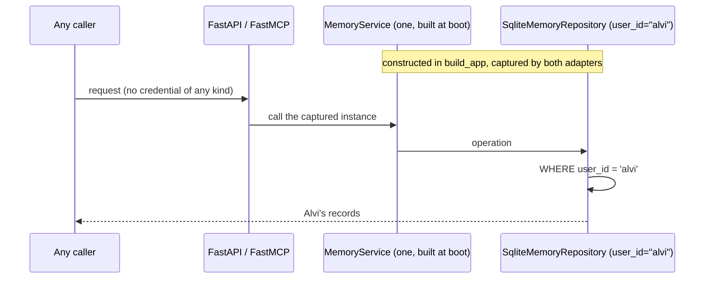
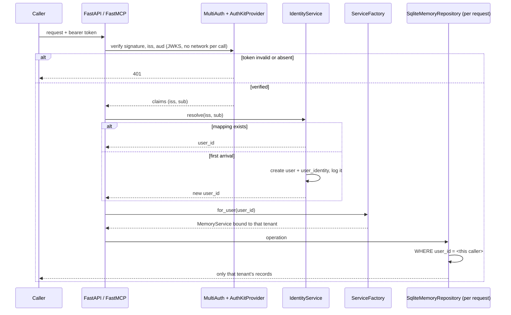

# High Wizard Plan

## **PROJECT INFO**
- **Project**: agent-memory-server (Munnin)
- **Date**: 2026-08-28
- **Agent**: software-architect
- **Theme**: Give Munnin a real tenant per request and a login, with the token issuer kept swappable
- **Source Protocol**: `/high-wizard` — /high-wizard

*CRITICAL INSTRUCTION: To continue this plan: load the source protocol above, then inspect which sections below are filled vs unfilled to infer your current step.*

---

## **INHERITED CONTEXT**
*Filled at investigation step 0 with whatever was settled before this plan existed. The two sources are recorded separately and never merged — write "None" under a part that does not apply.*
*These decisions are **not yours to reopen**. If one looks wrong, STOP and surface it to [USER-NAME] — do not silently re-decide it here or in Confirmed Decisions below.*

### From the Parent Plan
- **Parent plan**: None — not a sub-plan.
- **Assigned scope**: N/A
- **Integration contracts**: None
- **Pushed-down open items**: None

### From Pre-Planning Discussion
- **Discussion**: Pre-planning discussion with Alvi, 2026-08-28 (this session), building on the WorkOS decision recorded 2026-08-23.
- **Agreed scope**: Make the tenant a property of the request rather than of the process, add an internal user identity that survives changing issuers, and delegate token verification to a provider that can be swapped.

| # | Settled decision | Chosen | His reason | Status |
|---|------------------|--------|------------|--------|
| 1 | Who issues user tokens | Buy it — WorkOS AuthKit | Nobody buys Munnin because its login is good, and a defect there breaches every user's memory at once. Free to 1M monthly users. | Settled 2026-08-23 |
| 2 | Whether the issuer must be replaceable | Yes — a later move to Supabase must be setup only | *"I want the WorkOS is actually swappable (modular), so if someday I want to change to supabase everything goes easy (only need to setup the supabase)"* | Settled |
| 3 | What identifies a tenant in the store | An internal id we mint, never the issuer's subject | A subject is meaningless outside the issuer that minted it, so storing it would orphan every record on a swap. His response: *"exactly"* | Settled |
| 4 | Where the issuer-to-tenant mapping lives | Two new tables in Munnin's own schema | The mapping exists precisely so the issuer can change; storing it inside an issuer would destroy it on the swap it was built for | Settled |
| 5 | Whether Authentra is involved | No | Authentra is a token issuer for machine-to-machine calls with no human in it; it is neither an authenticator nor an authorizer, and this work needs neither of those from it | Settled |
| 6 | Order of work | Tenancy first, then the issuer wiring | Auth on top of a process-wide tenant is decoration — it would authenticate people into one shared mailbox | Settled |

- **Considered and rejected**:
  - *Store the issuer's `sub` directly as `user_id`* → a later issuer change orphans the entire memory store, and no abstraction layer can prevent it.
  - *Put the identity mapping inside Authentra* → self-defeating: the mapping's whole purpose is surviving an issuer change.
  - *Build our own pluggable-auth-provider abstraction* → FastMCP already ships one; a second abstraction over the first buys nothing.
  - *Build Authentra out into the authorization server* → deferred unless Authentra becomes a product to sell; that condition was set on 2026-08-23 and has not changed.
  - *Use Google directly as the authorization server* → it can never mint a token whose audience is Munnin.

- **Left open at the time, and both closed during this plan's rounds** (kept here as the record of what was still undecided when planning began):
  - What happens when a token arrives whose issuer-and-subject pair is not mapped → **closed by Confirmed Decision 5**: the tenant is created, unconditionally and logged, because WorkOS owns admission through its sign-up toggle. My earlier recommendation of a flat refusal was withdrawn once that became clear.
  - Whether the `user` table lands in this work or only `user_identity` → **closed by Confirmed Decisions 12 and 15**: both tables land, and `agent` joins the same referential chain.

---

## **OBJECTIVES**

Munnin currently decides whose memory it serves once, at process start, and serves it to anyone who can reach the host. This plan makes the tenant a property of each request, puts both served faces behind a verified token, and gives every person an internal identity that survives changing token issuers.

It exists because the deployed server is live and unauthenticated, and the memory import is deliberately blocked until this lands.

### **Related Documents**
- [MCP Remote Server Authorization + the Authentra Build-vs-Buy Decision](../../../../Users/alvia/.claude/@agent-memory/agent-software-architect/knowledge-base/research/2026-08-23-mcp-remote-server-authorization.md) — what the MCP spec demands of a resource server, why claude.ai needs public HTTPS, and the WorkOS decision this builds on.
- [memory-server-containerization-and-delivery.md](../../../../Users/alvia/.claude/@agent-memory/shared-memory/agent-memory/context/memory-server-containerization-and-delivery.md) — the live delivery pipeline this deploys through.
- Episode `2026-08-28 08.10` in [agent-memory-mcp-server-architecture.md](../../../../Users/alvia/.claude/@agent-memory/agent-software-architect/episodes/agent-memory-mcp-server-architecture.md) — the sibling session that put the server live and recorded the unauthenticated surface as a debt.

### **SUCCESS CRITERIA**
- [ ] Two identities writing through the same running server cannot read each other's records — proved by a test, not by inspection.
- [ ] Every route on both faces rejects an absent, expired, wrong-issuer or wrong-audience token; no endpoint is reachable unauthenticated.
- [ ] A person who has never signed in before gets a tenant created on first arrival, and that creation is logged.
- [ ] The existing suite still passes, with the app-level tests authenticating rather than being exempted.
- [ ] A real token from the live issuer is accepted by the deployed server, and its audience is confirmed by decoding the token — not by observing that login worked.
- [ ] `alvi` remains the internal identifier, and the reimported memory is reachable only by the identity mapped to it.

---

## **SCOPE**

### In Scope
- Two new tables — `user` and `user_identity` — with the mapping keyed on issuer plus subject, and the existing `agent` table brought into the same referential chain.
- The tenant resolved per request from the verified token's subject, replacing the process-wide constant.
- Token verification on **both** faces: the MCP app and every `/api/*` route, including the content endpoints, through one shared provider object.
- A `MultiAuth` composition wired with WorkOS as its only current member, so a second issuer is a list entry rather than a restructure.
- Tenant creation on first arrival for an identity that authenticated but has no mapping, logged when it happens.
- Application-level tests authenticating through a debug verifier, plus an isolation test that writes as one subject and proves another cannot read it.
- Verification against the live issuer on the deployed server, including decoding a real token to confirm its audience.

### Out of Scope
- **Per-user storage quotas, rate limiting, backup handling for other people's data, and account deletion.** Deferred deliberately. **Gate: WorkOS's own sign-up toggle must not be switched to public until these exist** — until then admission is by invitation and volume stays in single digits.
- **A machine-to-machine credential path.** Claude Code performs the interactive flow and caches the token, so nothing needs it yet. It becomes necessary when telegent connects, and lands as one verifier added to the `MultiAuth` list.
- **Seeding the fictional demo fleet.** Deferred until everything is up, by decision.
- **Migrating an existing populated database.** The deployed volume is recreated, so no data migration is written; a live-data path would need a migration framework this repo does not have.
- **Moving to Postgres.** Planned after Hermod, and nothing added here is SQLite-specific beyond the existing foreign-key pragma.
- **The sibling session's served-surface debts** — prompt and resource descriptions, tool parameter descriptions, the `serverInfo` version. Same repo, different lane.
- **Retiring the in-process Authentra seed.** Untouched; it solves machine-to-machine, which is a different problem.

---

## **CONFIRMED DECISIONS**
*Decisions made **by this plan** — both **asked-and-confirmed** by [USER-NAME] AND **written-through** (Zone A and B decisions made by the agent, recorded with their reasoning). The reasons serve as the analysis record.*
*Decisions settled before this plan existed — by a parent, or in a pre-planning discussion — belong in [INHERITED CONTEXT](#inherited-context) above, not here. Keeping them separate is what shows which decisions this plan actually owns.*

| # | Decision | Chosen | Reason |
|---|----------|--------|--------|
| 1 | Which surfaces sit behind the token | Both the MCP app and every `/api/*` route | The live server was measured answering `/api/agents` to an anonymous request; the sibling session's audit counts 17 routes of which 7 write. Binding the HTTP face to loopback would put the protection in deploy config that no test can reach. |
| 2 | Multi-user concerns not in this plan | Quotas, rate limits, backup handling and deletion all deferred, with a written gate | Admission is by invitation while WorkOS's sign-up toggle is off, so volume stays tiny. The gate is recorded because an unrecorded "we'll do it before launch" is how the current exposure happened. |
| 3 | Alvi's internal identifier | `alvi`, permanently | It is already stamped on ~1,289 records. Changing it is a full-store rewrite to make a column prettier, and the column is `TEXT` so no UUID is required. |
| 4 | Whether interviewers reach the instance holding real memory | Yes — one instance, tenancy isolates, demo account created inside it | Alvi's call. A second demo instance would keep his own agents off the deployed server, which was the point of deploying it. Consequence accepted: isolation is load-bearing on day one, so it gets a dedicated test rather than an assumption. |
| 5 | An authenticated identity with no mapping | Create the tenant, unconditionally, and log it loudly | WorkOS owns admission through its sign-up toggle and invitations. A second flag in Munnin would have to be kept in agreement with a third-party dashboard setting forever, with nothing reporting divergence. Logging gives detection without a second source of truth. |
| 6 | How the tenant stops being process-wide | Per-request service, resolved explicitly at each handler | A service object *is* a tenant, so no ambient state is involved and a reviewer sees the tenant at each call site. The repository holds only a path and a tenant and opens connections per call, so per-request construction is free. Rejected a context variable: smaller diff, but an unset value fails by reading someone else's rows. |
| 7 | How `/api/*` is guarded | A FastAPI dependency calling the same provider object | Two independently configured verifiers would have to agree forever with nothing reporting when they stop — the drift `test_twin_parity` exists to prevent. |
| 8 | Whether `MultiAuth` is wired now | Yes, with WorkOS as its only member | `MultiAuth(server=provider)` with an empty verifier list behaves identically to the provider alone, so the skeleton is free, and it has a named future occupant in telegent's machine token. |
| 9 | How an account is admitted before sign-up opens | Nothing built — invitation from the WorkOS dashboard | WorkOS ships a per-environment sign-up toggle and an invitation flow. Building a CLI or an admin endpoint would be a second door beside an existing one. |
| 10 | How Alvi's own agent sessions authenticate | Claude Code's built-in OAuth | It runs the flow once, caches the token in the system keychain and refreshes automatically. No machine credential is needed until an unattended consumer appears. |
| 11 | How application-level tests authenticate | FastMCP's `DebugTokenVerifier`, each test presenting a chosen subject | Lets the isolation test be written at all. Rejected disabling auth under test: the tested path would stop being the shipped path, on the most security-sensitive change in the plan. |
| 12 | Referential integrity for `agent` | Full chain — `agent` references `user` | Alvi's call, taken knowing SQLite cannot add a foreign key to an existing table. Viable only because the deployed volume is deleted and recreated, so the constraint exists from birth rather than being retrofitted. Also inherited cleanly by the later Postgres move. |
| 13 | The content endpoints | Behind the token like everything else | One rule with no exceptions is checkable. An unauthenticated exception is what produced the current hole. |
| 14 | `MUNNIN_USER_ID` in the deploy config | Retargeted, not removed | Still read by the importer to stamp records. It stops configuring the server's tenant and keeps configuring the import target — a comment change in a file the sibling session owns. |
| 15 | The provider class | `AuthKitProvider` | Written through, not asked: it is the only real candidate. It builds a `JWTVerifier` against AuthKit's JWKS so verification is local with no per-request outbound call, and it auto-binds the audience to the server's own URL, which turns a misconfigured resource indicator into a loud 401 rather than a silent hole. |
| 16 | Whether this plan introduces a secret | No | Written through: a resource server verifies against a **public** JWKS and holds no client credential. The sibling session's `docker`-group boundary debt is therefore not triggered by this work. |
| 17 | `/health` | Stays unauthenticated — the single exception to decision 13 | Written through: the Kamal configuration sets `healthcheck.path: /health`, so guarding it fails the deploy's health gate and the cutover never happens. It discloses status, service name and version only. Recorded as an exception with its reason so it does not read as an oversight later. |

---

## **SOLUTION**

### Architecture Overview

Three seams, in the order a request meets them.

**Verification.** `build_app` constructs one `MultiAuth(server=AuthKitProvider(...))`. That single object is handed to `FastMCP(auth=...)` and reused by a FastAPI dependency, so both faces verify identically by construction rather than by agreement.

**Identity.** A verified token yields an issuer and a subject. A tenant-free `IdentityRepository` looks that pair up in `user_identity`; on a miss it creates a `user` and a `user_identity` row and logs the creation. It returns the internal `user_id`. This repository deliberately holds no tenant, because it runs *before* a tenant is known — the existing tenant-bound repository cannot serve this lookup.

**Tenancy.** A `ServiceFactory` holds the database path and the content loader. `factory.for_user(user_id)` returns a `MemoryService` bound to that one tenant. Handlers call it; nothing else changes. `MemoryService` and `SqliteMemoryRepository` keep their existing constructors, which is why every service- and repository-level test survives untouched.

The old composition root built one service for the process. The new one builds a factory and lets each request name its own tenant.

### Component 1: Identity tables and resolver
- **Purpose**: Give every person an internal identifier that outlives whichever issuer authenticated them, and resolve a token to it.
- **Key Files**: `src/munnin/data_entities/schema.sql` (two new tables, `agent` gains its foreign key), `src/munnin/data_entities/user.py` (new), `src/munnin/data_repositories/identity_repository.py` (new, tenant-free), `src/munnin/business_services/identity_service.py` (new).

### Component 2: Per-request tenancy
- **Purpose**: Replace the process-wide constant with a tenant resolved per request, without changing the service or repository constructors.
- **Key Files**: `src/munnin/business_services/service_factory.py` (new), `src/munnin/app.py`, `src/munnin/api_http/api.py`, `src/munnin/api_mcp/server.py`.

### Component 3: Token verification on both faces
- **Purpose**: Ensure no route on either face is reachable without a token whose signature, issuer and audience all check out.
- **Key Files**: `src/munnin/configuration/config.py` (issuer domain and public base URL), `src/munnin/app.py` (the shared provider), `src/munnin/api_http/api.py` (the dependency), `src/munnin/api_mcp/server.py` (`auth=` on the server).

### Integration Architecture

| Component | Integrates with | Data flow | Depends on |
|---|---|---|---|
| `MultiAuth` + `AuthKitProvider` | `FastMCP(auth=)`, the FastAPI dependency | bearer token → signature, issuer and audience checked against AuthKit's JWKS → `AccessToken` with claims | AuthKit's public JWKS; **no secret** |
| `IdentityService` | both adapters, `IdentityRepository` | `(iss, sub)` → existing mapping, or a created `user` + `user_identity` pair → internal `user_id` | the two new tables |
| `ServiceFactory` | both adapters | `user_id` → a `MemoryService` bound to that tenant | `MemoryService`, `SqliteMemoryRepository` (constructors unchanged) |
| `api_http` dependency | `MultiAuth`, `IdentityService`, `ServiceFactory` | request → verified token → tenant → service, injected per route | all three above |
| `api_mcp` tools | the same three, via `get_access_token()` | identical chain, resolved inside each tool body | all three above |
| Importer | `IdentityRepository` | ensures the `user` row exists before upserting agents, because `agent` now references it | `MUNNIN_USER_ID`, retargeted to mean the import target |

### System Flow Diagrams

**Current State** — the tenant is decided once, before any request exists:

**End Result** — every request names its own tenant:

### Technical Considerations

- **SQLite cannot add a foreign key to an existing table.** `ALTER TABLE` does renames, add-column and drop-column only; a table-level constraint needs a full rebuild. Because the schema is applied with `CREATE TABLE IF NOT EXISTS`, writing the constraint into the file would apply it to **fresh databases only**, silently — new ones constrained, existing ones not, with nothing reporting the difference.
  - This is survivable solely because the deployed volume is deleted and recreated. That precondition is part of decision 12, not an implementation detail.
  - The local development store should be rebuilt the same way, or knowingly left without the constraint.
- **Foreign keys are off by default and enabled per connection.** The schema header already notes this and the repository sets the pragma in `_conn()`. The new `IdentityRepository` opens its own connections and must set it too, or its constraint is decorative. A test should prove rejection rather than assume the declaration works.
- **`/health` must stay unauthenticated.** The Kamal configuration sets `healthcheck.path: /health`, so guarding it would fail the deploy's health gate and the cutover would never happen. It exposes only status, service name and version.
- **The audience is bound automatically, which changes the failure mode in our favour.** `AuthKitProvider` creates its verifier with the audience bound to the server's own resource URL. A resource indicator that was never registered at WorkOS therefore produces tokens the server *rejects* — a loud 401 — rather than tokens it accepts unprotected. Verification is still by decoding a real token and reading the audience, never by observing that login worked.
- **Verification is local.** The provider builds a `JWTVerifier` against AuthKit's JWKS, so no outbound request happens per call. The `WorkOSTokenVerifier` class in the same module does call a userinfo endpoint per request — it belongs to a different provider and must not be used here.
- **Postgres is coming after Hermod.** Nothing added here is SQLite-specific: two tables of `TEXT` columns with a primary key and a foreign key port directly. The pragma and the FTS5 tables are pre-existing concerns, not new ones.
- **A temporary component exists between phases and must not survive.** Phase 2 introduces a static resolver so the suite stays green before verification is wired; phase 3 replaces it and deletes it. It is temporary by construction and named so.

---

## **IMPLEMENTATION PHASES**

### Phase 1: Identity tables and the resolver
*No authentication yet. Everything here is provable on its own.*

- [ ] **Step 1.1**: The two tables, and `agent` joins the chain
  - **Action**: Add `user` and `user_identity` to the schema; add the foreign key from `agent` to `user`.
  - **Implementation**: `user` holds the internal id, an optional display name and email (a **label and a matching hint, never a key**), and a creation date. `user_identity` is keyed on `(iss, sub)` and references `user`. `agent` gains its reference in the same file. Because SQLite cannot retrofit a constraint, this applies to a database created fresh — the deployed volume is deleted at Phase 4.
  - **Testing**: Extend `tests/data_entities/test_schema.py` for both tables; extend `tests/data_repositories/test_foreign_keys.py` to prove an unknown `user_id` is **rejected**, not silently accepted.
  - **Success Criteria**: A fresh database has both tables, and an orphan insert raises.

- [ ] **Step 1.2**: The tenant-free identity repository and service
  - **Action**: Add `IdentityRepository` and `IdentityService.resolve(iss, sub) -> user_id`.
  - **Implementation**: The repository takes only a database path — **no tenant**, because it runs before a tenant is known, which is why it cannot live on `SqliteMemoryRepository`. It must set the foreign-key pragma on its own connections. The service returns an existing mapping, or creates a `user` plus a `user_identity` row and logs the creation through the existing `logger/` box, at a level that survives production settings.
  - **Testing**: New unit tests — known pair resolves; unknown pair creates exactly one user and one identity; the same unknown pair twice is idempotent; two different subjects get two different users; a creation emits a log record.
  - **Success Criteria**: All pass, and the pragma is proved on this repository's own connection rather than inherited by assumption.

- [ ] **Step 1.3**: The importer ensures its user exists
  - **Action**: Make the importer create the `user` row before upserting agents.
  - **Implementation**: `importer.py` already reads `config.user_id`; that value now names the import target. Ensure the row, then proceed unchanged.
  - **Testing**: Extend `tests/data_migrations/test_importer.py` — importing into an empty database succeeds and leaves exactly one user; importing twice stays idempotent.
  - **Success Criteria**: A clean import into a fresh database passes with the new constraint in force.

### Phase 2: Per-request tenancy
*Still no authentication. The tenant becomes a parameter before it becomes a claim.*

- [ ] **Step 2.1**: The service factory
  - **Action**: Add `ServiceFactory` and stop building a service in `build_app`.
  - **Implementation**: The factory holds the database path and the content loader; `for_user(user_id)` returns a `MemoryService` bound to that tenant. `MemoryService` and `SqliteMemoryRepository` constructors are **unchanged**, which is what keeps the service- and repository-level tests untouched.
  - **Testing**: A factory test proving two calls with different ids yield services that cannot see each other's writes — the first form of the isolation proof.
  - **Success Criteria**: Every existing `business_services` and `data_repositories` test still passes with no edits.

- [ ] **Step 2.2**: Both adapters resolve per call
  - **Action**: Replace the captured service with a per-call resolution in all routes and all tools.
  - **Implementation**: `api_http` gains a dependency injecting the service per route; `api_mcp` tools open with one resolution line. Identity comes from a `StaticResolver(config.user_id)` — **temporary, marked temporary, deleted in Step 3.4** — so the suite stays green before verification exists.
  - **Testing**: The whole existing suite, unchanged, still green.
  - **Success Criteria**: No handler references a module-level service; behaviour is identical to before.

### Phase 3: Verification on both faces

- [ ] **Step 3.1**: The shared provider
  - **Action**: Build `MultiAuth(server=AuthKitProvider(...))` once in `build_app`.
  - **Implementation**: Config gains the AuthKit domain and the public base URL — no secret. Use `AuthKitProvider`, **not** `WorkOSTokenVerifier`, which calls a userinfo endpoint per request.
  - **Testing**: A test asserting the provider's verifier is JWKS-based and its audience is bound to the configured base URL.
  - **Success Criteria**: One provider object exists and is reachable by both adapters.

- [ ] **Step 3.2**: The MCP face
  - **Action**: Pass the provider as `auth=` to `FastMCP`; resolve identity from the verified token.
  - **Implementation**: Tools take issuer and subject from `get_access_token()` and pass them to `IdentityService`.
  - **Testing**: An unauthenticated tool call is rejected; an authenticated one reaches the right tenant.
  - **Success Criteria**: No tool is reachable without a valid token.

- [ ] **Step 3.3**: The HTTP face, with the one exception
  - **Action**: Guard every `/api/*` route, content endpoints included, through the same provider object.
  - **Implementation**: A FastAPI dependency reusing the provider's verifier — not a second verifier. **`/health` stays open** (decision 17): the Kamal health gate depends on it.
  - **Testing**: A test enumerating the app's routes and asserting every one except `/health` rejects an absent token — a route-count guard, so a future route added without a guard fails the suite.
  - **Success Criteria**: The enumeration passes and `/health` still answers unauthenticated.

- [ ] **Step 3.4**: Delete the temporary resolver
  - **Action**: Remove `StaticResolver` and every reference to it.
  - **Implementation**: Identity now comes only from a verified token.
  - **Testing**: A grep for the symbol returns nothing; the suite is green.
  - **Success Criteria**: No path exists by which a tenant is chosen without a token.

- [ ] **Step 3.5**: Application-level tests authenticate
  - **Action**: Move the five app-driving test files onto `DebugTokenVerifier`.
  - **Implementation**: Each test presents a token carrying a chosen subject. Auth is **never** disabled under test — the tested path stays the shipped path.
  - **Testing**: The five files pass while authenticating.
  - **Success Criteria**: The full suite is green with verification enforced throughout.

### Phase 4: Prove it, then ship it

- [ ] **Step 4.1**: The isolation proof
  - **Action**: Write the test the whole plan exists to make possible.
  - **Implementation**: Through the running app, authenticate as one subject and write a record; authenticate as a second subject and attempt to read, query, search and edit it. Every attempt must fail or return nothing — including full-text search, which reaches the records by a different path than `query` and is the likeliest place for a leak to hide.
  - **Testing**: Is the test.
  - **Success Criteria**: The second subject cannot observe the first's record by any route on either face.

- [ ] **Step 4.2**: Configure the issuer
  - **Action**: WorkOS dashboard — Google as a social connection, CIMD on, **the server URL registered as a resource indicator**, sign-up left invitation-only.
  - **Implementation**: Roughly ten minutes of dashboard entries; note the issuer URL for config.
  - **Testing**: MCP Inspector completes the flow locally against the deployed server.
  - **Success Criteria**: A real token is obtained outside claude.ai.

- [ ] **Step 4.3**: Deploy onto a recreated volume, and decode the token
  - **Action**: Delete the deployed volume so the schema is created with the constraint, deploy, then verify.
  - **Implementation**: Coordinate with the sibling session on `MUNNIN_USER_ID`'s changed meaning (decision 14). Deploy through the existing Kamal path.
  - **Testing**: `/health` answers; every other route rejects an anonymous request — re-run the exact probe that found the hole and confirm it now fails. **Decode a real token and read its audience**; a green login proves nothing.
  - **Success Criteria**: The audience is the server's own URL, and the previously-open probe returns 401.

- [ ] **Step 4.4**: Import the memory
  - **Action**: Run the import that has been deliberately blocked.
  - **Implementation**: Import as `alvi`; seed your `user_identity` row mapping your WorkOS subject to it.
  - **Testing**: Awaken through the deployed server as yourself and get the full payload; attempt the same as a second identity and get an empty store.
  - **Success Criteria**: Your fleet memory is reachable by you and by nobody else.

- [ ] **Step 4.5**: Re-authenticate the local agent sessions
  - **Action**: Reconnect this repository's Claude Code sessions to the now-guarded server.
  - **Implementation**: The sibling session pointed `.mcp.json` at the deployed server, so those sessions break the moment Step 4.3 lands. Claude Code runs the OAuth flow once and caches the token in the system keychain; it refreshes silently afterwards.
  - **Testing**: Start a session and call a Munnin tool; confirm it reaches your tenant.
  - **Success Criteria**: Local sessions work again without a machine credential, confirming decision 10 in practice rather than in principle.

> **Known consequence, not a gap**: a newly created tenant has no agents, so an interviewer's first `awaken` finds an empty store. That is what the deferred demo seed (OQ2) exists to fix, and it is deliberately not fixed here.

---

## **EXECUTION LOG**
**Execution Protocol for AI**:
I have to use this document as my **ONLY** source of truth to execute and track the plan steps iteratively. I should **NOT** use additional tools like ToDos because it lacks the context of what should I do. Everytime I want to implement a step I have to check the reference to the original step plan above. Everytime a step has been finished I need to go back to this document to log what was done.
*In other words*:
- I have to make this document as the source of truth for the implementation phase on what I have worked on and what I will be working
- The original plan must be fully in my context, therefore, I have to make sure I loaded the **Plan File** before executing any task and read carefully the reference to the original step
- I have to do the implementation by doing it in order per step THEN, I ALWAYS have to fill the step log rightly after

**Definition of Done (applies to ALL steps)**:
- ✅ **Code Quality**: Code compiles/runs without errors
- ✅ **Testing**: Tests written and passing
- ✅ **Logged**: Implementation and testing logged below
- 🚫 **Blocked**: Get input from [USER-NAME] before assuming

*Each entry below mirrors a step in Implementation Phases. Fill it immediately after the step, never in a batch at the end.*

### Phase 1: Identity tables and the resolver
- [x] **Step 1.1**: The two tables, and `agent` joins the chain
  - **Implementation Log**: Added `account` and `user_identity` to `schema.sql`, and the foreign key from `agent` to `account`. Rewrote the file header so it describes five tables as one list rather than carrying an appended note. **Two deviations from the plan text, both approved in conversation first**: the table is `account`, not `user` — `USER` is reserved in Postgres, which is the next database, so `CREATE TABLE user` would be a syntax error there and every later query would need quoting; and its primary key column keeps the name `user_id`, because `agent`, `shared_record` and `memory_record` already use it and not rewriting them is the entire point of the design. `email` is on `account` as a label and matching hint, commented as never a key.
  - **Testing Log**: The constraint's blast radius was **7 test files**, matching the estimate given before the decision. `conftest.py` gained `seed_account`, and `AutoAgentRepository` plus `seed_agent` now ensure the tenant — one change covering the ten files that use the double. The six deliberately double-free files got one explicit seeding line each, preserving the stated intent of `test_agents.py` and `test_foreign_keys.py`. **One implementation error, caught by running rather than by reading**: `seed_account` first opened a raw `sqlite3` connection, which failed with `no such table: account` because the schema is applied on the repository's first `_conn()`, not in `__init__`; rewritten to use `repo._conn()`, which is also what enables the foreign keys. Six new tests added — three in `test_schema.py` (one person holding two identities, the same subject string under two issuers being two identities, the same pair rejected twice) and three in `test_foreign_keys.py` (an agent naming an unknown tenant rejected, a known one accepted, and an identity mapping to an unknown tenant rejected). **270 passed**, up from 264; `ruff check` clean.
  - **Success Criteria**: **Pass.** A fresh database has both tables, and an orphan insert raises on both new links.
  - **Tech Debts**: `account` and `user_identity` are asymmetrically named — the first was renamed for Postgres, the second never needed it. Cosmetic, flagged rather than churned.
  - **Result**: Met. The chain is `account ← agent ← memory_record`, with `user_identity → account` alongside, and every link proved by a rejection rather than assumed from the declaration.
- [x] **Step 1.2**: The tenant-free identity repository and service
  - **Implementation Log**: Three new files. `data_entities/identity.py` holds `Account` and `UserIdentity` (named for the concern rather than the plan's `user.py`, which stopped fitting once the table became `account`). `data_repositories/identity_repository.py` takes only a path, opens its own connections and sets `PRAGMA foreign_keys` itself — copied deliberately from `SqliteMemoryRepository._conn` rather than shared, since the two have different lifetimes and the pragma is the thing most dangerous to inherit by assumption. `business_services/identity_service.py` resolves a pair, mints a `uuid4` tenant on a miss, and logs at **WARNING** rather than INFO so the event survives a raised log level — a new tenant should only appear when you invited somebody. Two design details worth naming: `ensure_account` deliberately does **not** refresh `display_name` or `email` on an existing tenant, because an issuer's profile claims are not authoritative over an account that already exists; and `resolve` re-reads after linking rather than returning what it minted, so two simultaneous first logins for one pair settle on whichever row the idempotent insert kept.
  - **Testing Log**: `tests/business_services/test_identity.py`, 11 tests, all green on the first run. Beyond the five the plan named: the same subject string under two issuers resolves to two tenants; two issuers may map to one tenant (the swap path); a known pair logs *nothing*, because a warning on every ordinary request would train the reader to ignore it; email is stored but proved not to be used for resolution; the pragma is proved on this repository's own connection; and a mapping naming an absent tenant is rejected.
  - **Success Criteria**: **Pass**, including the pragma proved rather than inherited.
  - **Tech Debts**: `_now()` is defined locally instead of shared with `sqlite_memory_repository`'s private one — a two-line duplication rather than reaching into another module's privates.
  - **Result**: Met. A verified token can now be turned into a tenant, and nothing else in the system knows how.

- [x] **Step 1.3**: The importer ensures its user exists
  - **Implementation Log**: `main()` now calls `IdentityRepository.ensure_account(Account(user_id=config.user_id))` before constructing the memory repository, with a comment recording that `MUNNIN_USER_ID` has changed meaning — it names which tenant an import lands in, not which tenant the server serves. Placed in `main()` rather than in `import_fleet` so the production entrypoint owns it and no function signature changes; the tests that call `import_fleet` directly go through `AutoAgentRepository`, which seeds the tenant already.
  - **Testing Log**: Two tests appended to `test_importer.py`, both driving the **real** `main()` through patched `argv` against the fake source tree — the honest test, since `main` builds the real repository and without the account row the first agent write would fail on the foreign key. One asserts the tenant exists with a stamped date; the other runs the import twice and asserts exactly one account, because re-importing is how this store is normally refreshed. **283 passed**; `ruff check` clean after fixing one line length and one import order.
  - **Success Criteria**: **Pass.** A clean import into a fresh database works with the constraint in force.
  - **Tech Debts**: None.
  - **Result**: Met.
- [ ] **Step 1.3**: The importer ensures its user exists
  - **Implementation Log**: · **Testing Log**: · **Success Criteria**: · **Tech Debts**: · **Result**:

### Phase 2: Per-request tenancy
- [x] **Step 2.1**: The service factory
  - **Implementation Log**: `business_services/service_factory.py` — `ServiceFactory(db_path).for_user(user_id)` returns a `MemoryService` bound to that tenant, with both existing constructors untouched. **Two deviations from the plan text, both improvements**: the factory does **not** hold the content loader, because framework content is identical for every tenant and putting it in a per-tenant object would imply a variation that does not exist — the adapters take it directly, as before. And services are **cached per tenant** rather than rebuilt per request, for a concrete reason found while writing it: the repository applies `schema.sql` on its first connection and then remembers, so a fresh instance per request would re-run five `CREATE TABLE IF NOT EXISTS` statements plus indexes and triggers on *every call*. The cached objects hold a path and a string.
  - **Testing Log**: `tests/business_services/test_service_factory.py`, 6 tests, green first run. The important three are the first form of the isolation proof: a second tenant cannot reach a record by `get`, by `query`, or by `search` — search tested separately because it reaches records through the full-text index rather than the browse query, which is a different path and the likeliest place for a leak.
  - **Success Criteria**: **Pass.** Every existing `business_services` and `data_repositories` test passed with no edits.
  - **Tech Debts**: The per-tenant cache is unbounded. Bounded in practice by the number of distinct tenants a process sees, and each entry is two fields, so it is a deliberate choice rather than a leak — but it is worth revisiting if signup ever opens to the public.
  - **Result**: Met.

- [x] **Step 2.2**: Both adapters resolve per call
  - **Implementation Log**: Added `business_services/tenant_resolver.py` — a `TenantResolver` protocol with one method, plus `StaticTenantResolver`, marked **TEMPORARY** in its own docstring and at its construction site in `build_app`, to be deleted in Step 3.4. Both adapters gained a nested `_svc()` helper and now take `(factory, resolver, content)`; all **26** call sites (13 per face) were transformed mechanically with `sed`, having first checked that every `service.` occurrence was a real call rather than prose, and that both files were already LF so `-i` would not rewrite their line endings. `build_app` builds the factory and the temporary resolver instead of a single service.
  - **Testing Log**: **289 passed**, `ruff check` clean. 🚨 **The plan's success criterion for this step was wrong and I wrote it**: it said the whole existing suite would stay green *unchanged*, reasoning that the service and repository constructors were untouched. They were — but `build_mcp` and `build_router` are constructors too, and four test files call them directly. Those needed a real change, not none. Added `mcp_for()` to `conftest.py` so face tests build the MCP surface the way `build_app` does, over a factory; `test_write_tools.py` now seeds its agent explicitly, because the face runs the real repository where the auto-creating double used to invent one. `test_smoke.py`'s ping test deliberately does **not** seed, since it runs against the *configured* database path and `ping` touches no store — seeding there would write rows into a real developer store for nothing.
  - **Success Criteria**: **Partial as written, met in substance.** Behaviour is identical and no handler references a module-level service; but four test files changed, where the criterion promised none.
  - **Tech Debts**: `/health` is now the one route that resolves no tenant. Correct and recorded as decision 17, but it is also the only asymmetry between the two faces, so it is the thing to check first if twin parity ever drifts.
  - **Result**: Met, with the success criterion corrected rather than quietly satisfied.

### Phase 3: Verification on both faces
- [ ] **Step 3.1**: The shared provider
  - **Implementation Log**: · **Testing Log**: · **Success Criteria**: · **Tech Debts**: · **Result**:
- [ ] **Step 3.2**: The MCP face
  - **Implementation Log**: · **Testing Log**: · **Success Criteria**: · **Tech Debts**: · **Result**:
- [ ] **Step 3.3**: The HTTP face, with the one exception
  - **Implementation Log**: · **Testing Log**: · **Success Criteria**: · **Tech Debts**: · **Result**:
- [ ] **Step 3.4**: Delete the temporary resolver
  - **Implementation Log**: · **Testing Log**: · **Success Criteria**: · **Tech Debts**: · **Result**:
- [ ] **Step 3.5**: Application-level tests authenticate
  - **Implementation Log**: · **Testing Log**: · **Success Criteria**: · **Tech Debts**: · **Result**:

### Phase 4: Prove it, then ship it
- [ ] **Step 4.1**: The isolation proof
  - **Implementation Log**: · **Testing Log**: · **Success Criteria**: · **Tech Debts**: · **Result**:
- [ ] **Step 4.2**: Configure the issuer
  - **Implementation Log**: · **Testing Log**: · **Success Criteria**: · **Tech Debts**: · **Result**:
- [ ] **Step 4.3**: Deploy onto a recreated volume, and decode the token
  - **Implementation Log**: · **Testing Log**: · **Success Criteria**: · **Tech Debts**: · **Result**:
- [ ] **Step 4.4**: Import the memory
  - **Implementation Log**: · **Testing Log**: · **Success Criteria**: · **Tech Debts**: · **Result**:
- [ ] **Step 4.5**: Re-authenticate the local agent sessions
  - **Implementation Log**: · **Testing Log**: · **Success Criteria**: · **Tech Debts**: · **Result**:

---

## **QUALITY REVIEW**
*Filled by procedure Step 16 (delegated to `/analyze-code-quality` in embedded mode) after all execution phases are complete. **Static** review — answers "is the code clean?".*

- **Scope**: [Files reviewed — from Execution Log, reconciled against `git diff --name-only`]
- **Quality Standard**: [quality-standard.md found / not found — dimensions applied]
- **Findings**: [Issues found, or "No findings — implementation meets quality dimensions"]
- **Fixed**: [What was fixed from approved findings, or "N/A"]

---

## **QA HANDOFF**
*Filled by procedure Step 17 after Quality Review is resolved. This plan is **not** runtime-verified — this section records the plan for that verification, which happens in a QA session with the stack up.*

- **Scope**: [Modules touched — mapped from Execution Log scope]
- **QA instrument**: [Set up (map + bench) / NOT SET UP — auto-skipped]
- **Integration coverage**: **In scope** — bench built (all four R/I/A/O phases `documented`) and a server answers on `127.0.0.1:8200` (`/health` → HTTP 200, checked 2026-08-28). **Phase 4 Step 4.1 carries an `/integration-test` run**: the isolation proof authenticates as two subjects against a *started* server, which is integration by the substitution rule — the server is started, not constructed. Phases 1–3 do not: their boundaries are a temp SQLite the test constructs itself and a doubled token verifier, neither of which is a started system. Steps 4.3–4.5 are **live-system verification against the deployed host**, which sits above `/integration-test` and is recorded here so its absence from the integration count is not read as a gap.
  - ⚠️ **Caveat on the probe**: what answered on 8200 is most likely the long-running local instance left up since 2026-08-21, not a server started by `qa/scripts/start-server.sh`. Its database is therefore not the QA seed. Before Step 4.1, run the bench's own RESET → INJECT → ACT cycle so the isolation test starts from a known state rather than from whatever that instance holds.
- **Checklist**: [`qa/checklists/{feature}.md`, or "none — skipped, reason"]
- **Coverage split**: [N automated (named tests) / N manual — of which N are UI-bound]
- **Runtime verification**: **NOT DONE.** Next action: [`/run-qa-test --checklist qa/checklists/{feature}.md` once the stack is up | set up the instrument first: `/map-qa-instrument create` → `/build-qa-bench`]

> Do not read a filled checklist as a passed one. This section says a verification *plan* exists, nothing more.

---

## **POST-COMPLETION**
After all phases are executed, logged, and both **Quality Review** + **QA Handoff** are filled, move this plan to `plans/completed/`:
`mkdir -p ./plans/completed && mv ./plans/[this-file].md ./plans/completed/[this-file].md`
