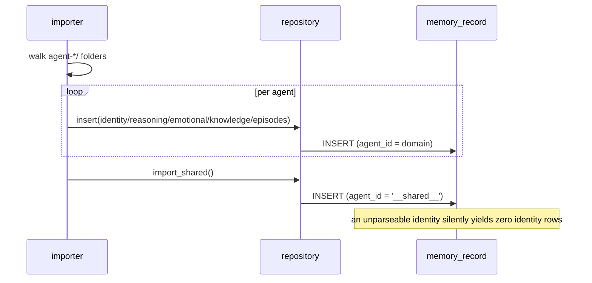
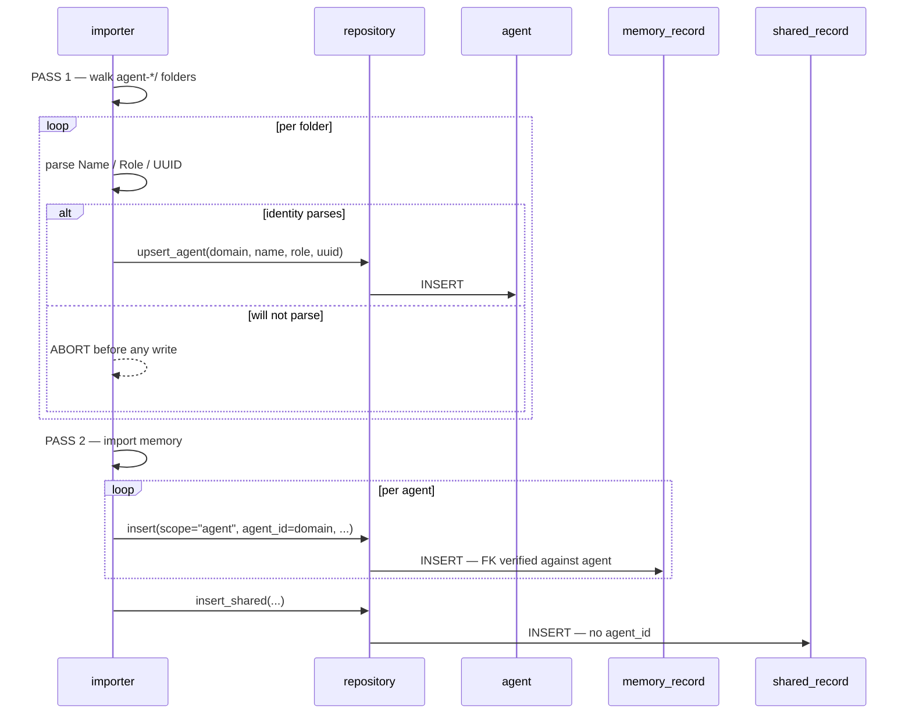

## **PROJECT INFO**
- **Project**: agent-memory-server (Munnin)
- **Date**: 2026-08-20
- **Agent**: Claude Meta
- **Theme**: Agent identity as a first-class entity — decide whether `agent_id` / name / role / UUID leave the uniform `memory_record` model, and what that means for `list-agents`, `create-agent`, the importer, and the pending `user-profile` record
- **Source Protocol**: `/high-wizard` — /high-wizard

*CRITICAL INSTRUCTION: To continue this plan: load the source protocol above, then inspect which sections below are filled vs unfilled to infer your current step.*

---

## **INHERITED CONTEXT**

None — standalone plan.

De-escalated from an abandoned `/quick-wizard` on `list-agents` (2026-08-20). That QW is **not** a parent: it produced no confirmed decisions that bind this plan, and its central assumption — that agent identity belongs inside `memory_record` — is the very thing this plan exists to decide. Its working tree is uncommitted and its fate is Round 1's business.

---

## **OBJECTIVES**

Give an agent a row of its own, so that "which agents exist" is a fact the database holds rather than an inference drawn from a `SELECT DISTINCT` over memory items, and an agent's name, role and UUID are typed columns rather than lines scraped out of a markdown blob with a regex.

The change is affordable because Valaskjalf is currently a rebuildable projection of the markdown store — markdown stays authoritative, B′ is not activated — so the migration path is **purge and re-import**, and no data is at risk.

### **Related Documents**
- [ADR-013 — Memory MCP Server: DB Persistence, Store Ownership & Transport Split](../../../.claude/@agent-memory/docs/adr/2026-08-08-memory-server-db-and-store-ownership.md) — Decision 5's uniform-record model, which this plan amends for entities
- [memory-mcp-server.md](../../../.claude/@agent-memory/docs/architecture/memory-mcp-server.md) — §3 schema, §7 HTTP contract
- [db.md](control-files/procedures/memory/storage-backends/db.md) — the served DB backend, rewritten by this plan

### **SUCCESS CRITERIA**
- [x] `agent` table exists, composite PK `(user_id, agent_id)`, **27 rows** after re-import
- [x] `memory_record.agent_id` is `NOT NULL` with a composite FK to `agent`; an insert naming an unknown agent **is rejected** — proven by a rejection test, not a happy-path one
- [x] `PRAGMA foreign_keys = ON` set on every connection, verified by that same rejection test
- [x] Shared memory lives in its own table with **no `agent_id`**, holding only `reasoning` + `knowledge`; ~~**61 rows**~~ **55 rows** after re-import — 55 is the markdown's true content; the old 61 held six rows the delete-free importer had orphaned (Step 4.2)
- [x] `__shared__` no longer exists as a stored value or an API token anywhere
- [x] `MemoryService.list_agents()` reads columns — **zero markdown parsing in `business_services`**
- [x] Search returns two labelled groups from two methods; callers merge
- [x] Importer is two-pass and refuses an agent whose identity will not parse, before writing anything
- [x] `/list-agents` served as Prompt **11**; served `db.md` carries no "Deferred" text
- [x] Full suite green (**243**), ruff clean, control-files green (**38** tests · `--strict` compile exit 0 · core invariant)
- [x] Static quality review completed (Step 16) — 2 medium + 2 low, all four fixed
- [x] QA Handoff completed (Step 17) — **auto-skipped, loudly**: no `qa/qa-map.md`, so no checklist was written. **Not runtime-verified.**

---

## **SCOPE**

### In Scope
- `agent` table; `shared_record` table; `memory_record.agent_id` `NOT NULL` + composite FK
- `PRAGMA foreign_keys = ON` in the repository's connection factory
- Repository: `list_agents()`, shared-memory read/write methods, search split into two methods
- `MemoryService`: roster from columns; shared reads retargeted; search composition
- Both faces (MCP tool + HTTP route) for the roster, kept at twin parity
- Importer: two-pass — build the agent table from every `agent-*/` folder, then import memory
- Purge and re-import the local DB
- `control-files/procedures/memory/storage-backends/db.md` — `list-agents`, `create-agent` and `core-instruction-control-files` ops rewritten for the new model
- `/list-agents` registered as the eleventh served Prompt
- Arch-doc ops-table row; ADR recording the amendment to ADR-013 D5

### Out of Scope
- **`user-profile` as an entity** — same class of question, deliberately deferred and re-decided against whatever this lands
- **The `awaken()` payload** — identity stays a list of whole records; awakening is untouched
- **Login / multi-tenant `user_id`** — still absent by design; `user_id` remains a server-side constant
- **B′ activation** — markdown stays authoritative; this does not switch the fleet to DB reads
- **Agent deletion** — no operation retires an agent, and this plan does not invent one

---

## **CONFIRMED DECISIONS**

| # | Decision | Chosen | Reason |
|---|----------|--------|--------|
| 1 | How far the change reaches | Agent entity only; `user-profile` deferred | `list-agents` is a working consumer sitting right here, which turns a schema decision into something observable. `user-profile`'s hard part is an interactive first-run ask — behaviour, not shape — so bundling makes the schema wait on a UX decision. |
| 2 | The uncommitted `list-agents` tree | Keep uncommitted; rework and commit once the shape lands | The transport half survives any outcome, so reverting discards work that isn't wrong. Committing now would publish a **served instruction** describing regex-scraped fields — the part most likely to change. |
| 3 | `awaken()` payload | Unchanged — identity stays whole records | Out of scope by [USER-NAME]'s call. Keeps the entity serving `list-agents` and `create-agent` only. |
| 4 | `agent` table key | Composite PK `(user_id, agent_id)` | The natural key is unique and stable, and a domain is already validated kebab-case. `memory_record`'s surrogate int PK exists for **FTS5 external-content rowid linking**; an agent row is never full-text indexed, so the surrogate would have no job. |
| 5 | Where shared memory lives | **Separate table**, `user_id` only, no `agent_id` | Keeps `agent_id NOT NULL` with an **unconditional** FK — a constraint with no exceptions beats one leaning on NULL semantics. Also lets the schema enforce what was only ever convention: shared memory is `reasoning` + `knowledge`, never episodes. |
| 6 | Full-text search across two tables | Two indexes, two methods, two labelled groups; caller merges | FTS5 external-content binds one index to one content table. Same principle as 5 — the repository exposes each table plainly, composition happens upward. Cost accepted: bm25 is per-corpus, so cross-group ranking is no longer strictly comparable (measured `-1.0e-06` vs `-1.57e-06` for equivalent hits). |
| 7 | Import order and identity failure | Two-pass; identity **required** — no parseable identity means no agent row and that agent's memory does not import, loudly | Pass 1 fails before anything is written, so the failure is up front rather than half-way. An agent without identity is not an agent; this morning's silent five-agent loss becomes impossible to miss. |
| 8 | *(written through)* Agent lifecycle columns | **None** — no `archived_date`, no `deleted_date` | No operation retires an agent. Inventing lifecycle columns for a lifecycle that does not exist is the error already made once today in prose. |
| 9 | *(written through)* Where markdown parsing lives | Moves from `business_services` to the importer | Translating markdown into records is `data_migrations`' job. `MemoryService.list_agents()` becomes a plain column read. |
| 10 | *(written through)* `__shared__` sentinel | Deleted entirely — not a stored value, not an API token | A separate table plus separate methods removes every reason it existed. `validate_write_agent` collapses back into `validate_domain`. |
| 11 | *(written through)* `PRAGMA foreign_keys = ON` | Set in the connection factory | SQLite defaults it **OFF** and `_conn()` currently sets only `journal_mode=WAL`. Without it the FK is a silent no-op: every valid insert passes and the constraint never fires. |
| 12 | *(written through)* Migration path | Purge and re-import | [USER-NAME]'s ruling. The DB is a rebuildable projection while markdown is authoritative, so there is no migration to write and no data to preserve. |

---

## **SOLUTION**

### Architecture Overview

One table becomes three. `agent` holds the entity — an agent exists because it has a row, not because memory happens to mention it. `shared_record` holds fleet memory, which no agent owns. `memory_record` **is `shared_record` plus `agent_id`**, and that column carries an unconditional foreign key to `agent`, so a memory item cannot name an owner who does not exist.

The tool surface does not grow. Every consequence of the split is absorbed inside the repository: uuid-addressed operations resolve which table holds the id, `query` unions both tables when no agent is named, and `search` runs two indexes whose results the service merges. Only `insert` changes shape, because it alone decides *where* to write and cannot infer it.

### Component 1: Schema

- **Purpose**: three tables, two full-text indexes, and the pragma that makes the foreign key real.
- **Key Files**: `src/munnin/data_entities/schema.sql`

```sql
-- The agent entity. No lifecycle columns: nothing retires an agent.
CREATE TABLE IF NOT EXISTS agent (
  user_id      TEXT NOT NULL,
  agent_id     TEXT NOT NULL,   -- kebab domain; equals the agent-[domain]/ folder name
  name         TEXT,            -- **Name** from the identity document
  role         TEXT,            -- **Role**, falling back to **Main Purpose**
  uuid         TEXT,            -- the agent's own "digital soul" id — content, never a key
  created_date TEXT NOT NULL,
  PRIMARY KEY (user_id, agent_id)
);

-- Fleet-shared memory: owned by no agent. CHECK enforces what was only ever convention.
CREATE TABLE IF NOT EXISTS shared_record (
  id INTEGER PRIMARY KEY, uuid TEXT NOT NULL UNIQUE, user_id TEXT NOT NULL,
  record_type TEXT NOT NULL CHECK (record_type IN ('reasoning','knowledge')),
  project TEXT, title TEXT, tags TEXT,
  created_date TEXT NOT NULL, modified_date TEXT NOT NULL,
  archived_date TEXT, deleted_date TEXT, full_content TEXT
);

-- Agent memory = shared_record + agent_id, with the owner enforced.
CREATE TABLE IF NOT EXISTS memory_record (
  id INTEGER PRIMARY KEY, uuid TEXT NOT NULL UNIQUE, user_id TEXT NOT NULL,
  agent_id TEXT NOT NULL,
  record_type TEXT NOT NULL,
  project TEXT, title TEXT, tags TEXT,
  created_date TEXT NOT NULL, modified_date TEXT NOT NULL,
  archived_date TEXT, deleted_date TEXT, full_content TEXT,
  FOREIGN KEY (user_id, agent_id) REFERENCES agent(user_id, agent_id)
);
```

`shared_fts` mirrors `memory_fts` — external-content FTS5 over `full_content` / `title` / `tags`, with its own insert/delete/update triggers. `project` is kept on both tables as the placeholder for Hermod's future project scope; it is NULL on all 1,439 current rows because Munnin skips project-scoped content by design.

### Component 2: Data entities

- **Purpose**: make the Python mirror the SQL — one type that is the other plus a column.
- **Key Files**: `src/munnin/data_entities/memory_record.py`

`SharedRecord` carries every common field. `MemoryRecord(SharedRecord)` adds `agent_id`. Both are `@dataclass(kw_only=True)` — required, because a subclass cannot add a non-default field after defaulted base fields without it (`TypeError: non-default argument 'agent_id' follows default argument`). `isinstance(MemoryRecord, SharedRecord)` holds, so shared projections work on both. A small `Agent` dataclass carries the entity. `SHARED_AGENT_ID` and `validate_write_agent` are deleted; `validate_domain` remains.

### Component 3: Repository

- **Purpose**: absorb every consequence of the split, so nothing above it needs to know there are two tables.
- **Key Files**: `src/munnin/data_repositories/memory_repository.py`, `sqlite_memory_repository.py`

`_conn()` gains `PRAGMA foreign_keys = ON` beside the existing WAL pragma. A `_locate(uuid) -> (table, row) | None` helper answers "which table holds this" once, and the seven uuid-addressed operations route through it; the table name is interpolated from a two-value whitelist, since SQLite cannot parameterise it. New: `upsert_agent()`, `list_agents()`, `insert_shared()`, `query_shared()`, `search_shared()`. `query()` unions both tables when `agent_id is None` and hits `memory_record` alone when an agent is named.

### Component 4: Service

- **Purpose**: composition — merge what the repository exposes separately.
- **Key Files**: `src/munnin/business_services/memory_service.py`

`list_agents()` becomes a plain column read; the three regexes and `_identity_fields` are **deleted from this layer**. `search()` calls both repository methods and merges. `insert()` gains `scope` and validates the pair: `scope="agent"` without `agent_id`, or `scope="shared"` with one, both raise `ValueError`. `awaken()`'s shared reads retarget to `shared_record`.

Merged results stay **self-labelling** without a wrapper: an agent record's projection carries `agent_id`, a shared record's has no such field, because `SharedRecord` does not define one. Decision 6's "two labelled groups" is therefore satisfied by the record shape itself rather than by an envelope the caller has to unpack.

### Component 5: Both faces

- **Purpose**: keep twin parity while the surface stays at 13 tools plus `list_agents`.
- **Key Files**: `src/munnin/api_mcp/server.py`, `src/munnin/api_http/api.py`

`list_agents` tool + `GET /api/agents`. `insert` / `/api/insert` gain `scope`. Nothing else changes shape.

### Component 6: Importer — two passes

- **Purpose**: build the agent table before any memory, so the foreign key can hold.
- **Key Files**: `src/munnin/data_migrations/importer.py`, `markdown_parser.py`

Pass 1 walks every `agent-*/` directory, derives `agent_id` from the folder name, parses `**Name**` / `**Role**` / `**UUID**` from the identity document, and writes the agent rows. **A folder whose identity will not parse produces no row and aborts the run before anything is written.** Pass 2 imports memory keyed on those `agent_id`s. The name/role regexes move here from `business_services`. `stable_uuid`'s first component becomes a fixed `"shared"` token for shared records, preserving cross-table uuid uniqueness.

### Component 7: Served content

- **Purpose**: the instruction agents read must describe the model that exists.
- **Key Files**: `control-files/procedures/memory/storage-backends/db.md`, `procedures/list-agents.md`, `src/munnin/content/loader.py`

`db.md`'s `list-agents`, `create-agent` and `core-instruction-control-files` sections rewritten; all seven `__shared__` mentions removed. `list-agents` registered as the eleventh Prompt.

### Integration Architecture

| Component | Integrates with | Data flow | Depends on |
|---|---|---|---|
| Schema | everything | DDL applied on repository init | — |
| Data entities | repository, service, importer | row ⇄ dataclass | Schema |
| Repository | service, importer | SQL ⇄ records; owns two-table resolution | Schema, entities |
| Service | both faces | repository reads → composed payloads | Repository |
| Faces | MCP + HTTP clients | tool/route → service | Service |
| Importer | repository | markdown → agent rows, then records | Repository, parser |
| Served content | agents | `db.md` → composed Prompt | `_PROMPTS`, loader |

Ordering is load-bearing: schema → entities → repository → service → faces, then importer, then purge-and-reimport, then served content. The foreign key means **no memory can be written until the agent table exists**, so the importer cannot be tested before the repository is done.

### System Flow Diagrams

**Current — one pass, one table:**


**End result — two passes, three tables:**


### Technical Considerations

- **The `foreign_keys` pragma is the whole constraint.** SQLite defaults it OFF and the repository opens a connection per operation, so a miss makes the FK inert while every test still passes. The only proof is a **rejection** test — insert naming an unknown agent must raise `IntegrityError`.
- **bm25 is per-corpus.** Splitting the index means agent and shared relevance scores are no longer strictly comparable (measured `-1.0e-06` vs `-1.57e-06` for equivalent hits). Accepted: 61 shared rows against 1,378, and nobody reads the scores.
- **Purge and re-import, not migrate.** The DB is a rebuildable projection while markdown is authoritative. `del data/valaskjalf-memory.db` then `importer --all`. No migration runner exists and none is written.
- **`kw_only=True` changes construction.** Every `MemoryRecord(...)` call becomes keyword-only. Current call sites already use keywords, so the change should be inert — verify rather than assume.
- **Table names are interpolated, not parameterised.** SQLite forbids a bound parameter in that position. The whitelist is two constants and never reaches user input.
- **`insert`'s contradiction cases are runtime failures.** `scope="agent"` with no `agent_id`, and `scope="shared"` with one, both raise `ValueError` with an explicit message. This is the cost of decision 15C and each case gets a test.
- **The live DB is stale between Phase 1 and Phase 4.2.** The schema changes before the purge, so `data/valaskjalf-memory.db` briefly holds the old shape while the code expects the new one. Nothing should read it in that window. Confirmed safe: the three live-store tests read the real **markdown** store, not the DB, and no test opens `data/`. Verify that still holds before starting Phase 1 rather than trusting this note.
- **Tests move with the code they cover.** The abandoned QW's `test_list_agents.py` holds twelve tests, of which the six covering `**Name**` / `**Role**` / `**Main Purpose**` extraction belong wherever the parsing lives. When the regexes move to the importer those tests move too — deleting them alongside the service code would silently drop coverage that is still needed, including the mutation-proved precedence test.

### Solution Options & Evaluation

| # | Option | Description |
|---|---|---|
| 1 | Keep the uniform record | Status quo: `SELECT DISTINCT` for existence, regex for name and role |
| 2 | Agent table, nullable `agent_id` | One memory table; NULL means shared; composite FK satisfied by NULL |
| 3 | Agent table, FK, `__shared__` given a row | The sentinel becomes a real row so the constraint holds |
| 4 | Agent table, FK, `CHECK` exempting the sentinel | Integrity without a fake agent row |
| 5 | **Three tables — agent, shared, memory = shared + agent_id** | **Chosen** |
| 6 | Three tables + twin every op | As 5, with `_shared` variants of all 11 operations |
| 7 | One contentless FTS index across both tables | Single calibrated ranking, disjoint rowid scheme |
| 8 | Agent UUID as primary key | The agent's own id as the table key |

| Option | Pros | Cons |
|---|---|---|
| 1 | No work | Existence is inferred; identity is untyped; the failure mode is silent — five agents were hollow for months |
| 2 | Minimal schema change | Relies on MATCH SIMPLE NULL semantics; keeps a nullable owner, which is the overloading being removed |
| 3 | Unconditional FK | Puts a row in `agent` that is not an agent — surrenders the sentinel's entire design argument |
| 4 | No fake row | A constraint with a carve-out for a magic string; import order becomes load-bearing anyway |
| 5 | FK with no exceptions; Python mirrors SQL exactly; `CHECK` enforces shared types | Two tables to keep in step; search ranking splits; ~10 lines of resolution machinery |
| 6 | Nothing ever touches an unnamed table | +1,567 B of permanently-resident tool descriptions to distinguish what a uuid already distinguishes |
| 7 | One calibrated ranking | A rowid allocation scheme maintained forever; index no longer rebuildable from content |
| 8 | Natural-looking key | That UUID is content — a human edits it in a markdown line. A key you can retype is not a key |

**Chosen**: option 5. It is the only shape where the foreign key holds unconditionally, and it makes the Python type hierarchy a true statement about the schema rather than an approximation of it.

### ADR Output

- **ADR File**: `C:\Users\alvia\.claude\@agent-memory\docs\adr\2026-08-20-agent-identity-as-first-class-entity.md` (ADR-015) — created at Step 11
- **Decision Summary**: agent identity leaves the uniform memory-record model and becomes its own table, with fleet-shared memory separated so `memory_record.agent_id` can carry an unconditional foreign key. Amends ADR-013 Decision 5, whose uniform-record rule governs memory *items* and never ruled on entities.

---

## **IMPLEMENTATION PHASES**

### Phase 1: Schema and entities

- [ ] **Step 1.1**: Three tables and two FTS indexes
  - **Action**: rewrite `schema.sql` with `agent`, `shared_record`, and `memory_record` carrying `agent_id NOT NULL` + composite FK; add `shared_fts` and its three triggers
  - **Implementation**: DDL from Component 1; keep `idx_memory_browse`, add its shared equivalent
  - **Testing**: apply to a temp DB; assert all three tables and both FTS tables exist; assert the `CHECK` rejects `record_type='episode'` on `shared_record`
  - **Success Criteria**: schema applies idempotently; the CHECK rejection is proven, not assumed

- [ ] **Step 1.2**: `PRAGMA foreign_keys = ON`
  - **Action**: add it to `_conn()` beside `journal_mode=WAL`
  - **Implementation**: one line in the connection factory
  - **Testing**: a **rejection** test — inserting a record naming an unknown agent raises `IntegrityError`; and a cross-tenant test — the same agent name under another `user_id` is also rejected
  - **Success Criteria**: both rejections observed. Mutation-prove by removing the pragma and confirming the test goes red

- [ ] **Step 1.3**: `SharedRecord` / `MemoryRecord` / `Agent`
  - **Action**: split the dataclass; delete `SHARED_AGENT_ID` and `validate_write_agent`
  - **Implementation**: `@dataclass(kw_only=True)` on both; `MemoryRecord(SharedRecord)` adds `agent_id`
  - **Testing**: `isinstance` holds; existing construction sites still work; `validate_domain` still rejects reserved names
  - **Success Criteria**: no remaining reference to `SHARED_AGENT_ID` in `src/`

### Phase 2: Repository

- [ ] **Step 2.1**: Agent operations
  - **Action**: `upsert_agent()` and `list_agents()` on the Protocol and the SQLite implementation
  - **Testing**: roster is sorted, tenancy-scoped, and returns columns rather than parsed text
  - **Success Criteria**: a second tenant's agents are invisible

- [ ] **Step 2.2**: `_locate()` and the seven uuid-addressed operations
  - **Action**: add the helper; route `get`, `edit`, `append`, `prepend`, `multi_edit`, `archive`, `soft_delete` through it
  - **Implementation**: table name interpolated from a two-value whitelist
  - **Testing**: each of the seven operates correctly on a shared record and on an agent record; a missing uuid still raises `LookupError`
  - **Success Criteria**: all seven pass against both tables

- [ ] **Step 2.3**: Shared read/write and the search split
  - **Action**: `insert_shared()`, `query_shared()`, `search_shared()`; `query()` unions when `agent_id is None`; fix `query`'s docstring — it filters by field value and returns bodies
  - **Testing**: `query(agent_id="meta")` returns no shared rows; `query()` returns both; both search methods return their own corpus
  - **Success Criteria**: union and isolation both proven

### Phase 3: Service and faces

- [ ] **Step 3.1**: Service composition
  - **Action**: `list_agents()` from columns; delete the regexes and `_identity_fields`; `search()` merges two groups; `insert(scope=...)` with pair validation; `awaken()` shared reads retargeted
  - **Testing**: `grep` proves zero markdown parsing remains in `business_services`; both `insert` contradiction cases raise `ValueError`; `awaken()` still returns the same shape
  - **Success Criteria**: awaken's payload is unchanged — decision 3 held

- [ ] **Step 3.2**: Both faces
  - **Action**: `list_agents` tool + `GET /api/agents`; `scope` on `insert` and `/api/insert`
  - **Testing**: twin parity for the roster and for a shared insert
  - **Success Criteria**: parity green; tool count 14

### Phase 4: Importer and re-import

- [ ] **Step 4.1**: Two-pass import
  - **Action**: pass 1 builds agent rows from folder names + parsed identity, aborting before any write on a parse failure; pass 2 imports memory; move the name/role regexes here; `stable_uuid` gets a fixed `"shared"` token
  - **Testing**: a fixture agent with a malformed heading aborts the run and writes **nothing**; a healthy fleet imports fully. **Move**, do not delete, the six identity-extraction tests from `tests/business_services/test_list_agents.py` — including the mutation-proved `Role`-beats-`Main Purpose` precedence case — into the importer's test module alongside the regexes they cover
  - **Success Criteria**: abort proven to leave an empty DB, not a partial one; test count does not fall when the parsing moves

- [ ] **Step 4.2**: Purge and re-import the live DB
  - **Action**: delete `data/valaskjalf-memory.db`, run `importer --all`
  - **Testing**: 27 agent rows, 1,378 agent records, 61 shared records; every agent row has a non-null name and role
  - **Success Criteria**: counts match the pre-change measurements exactly

### Phase 5: Served content and close

- [ ] **Step 5.1**: `db.md` and Prompt 11
  - **Action**: rewrite the three affected sections; remove all seven `__shared__` mentions; register `list-agents` in `_PROMPTS`; bump the three count assertions to 11
  - **Testing**: served Prompt carries the new ops, no "Deferred", no leftover seam header; control-files CI green
  - **Success Criteria**: 11 served prompts; `--strict` compile exit 0; core invariant green

- [ ] **Step 5.2**: ADR and arch doc
  - **Action**: write ADR-015 from section F; add the `list-agents` row to the arch-doc ops table
  - **Testing**: the ADR's H1 declares its number so the reference resolves in the private repo
  - **Success Criteria**: ADR committed in `@agent-memory/docs/adr/`; **no ADR number cited from this repo's code** (`e1175b6a`)

---

## **EXECUTION LOG**
**Execution Protocol for AI**:
I have to use this document as my **ONLY** source of truth to execute and track the plan steps iteratively. I should **NOT** use additional tools like ToDos because it lacks the context of what should I do. Everytime I want to implement a step I have to check the reference to the original step plan above. Everytime a step has been finished I need to go back to this document to log what was done.

**Definition of Done (applies to ALL steps)**:
- ✅ **Code Quality**: Code compiles/runs without errors
- ✅ **Testing**: Tests written and passing
- ✅ **Logged**: Implementation and testing logged below
- 🚫 **Blocked**: Get input from [USER-NAME] before assuming

### Phase 1: Schema and entities
- [x] **Step 1.1**: [Three tables and two FTS indexes](#phase-1-schema-and-entities)
  - **Implementation Log**: Rewrote `src/munnin/data_entities/schema.sql`. Added `agent` (composite PK `(user_id, agent_id)`, no lifecycle columns) and `shared_record` (no `agent_id`, `CHECK (record_type IN ('reasoning','knowledge'))`). `memory_record` keeps its shape and gains `agent_id NOT NULL` plus `FOREIGN KEY (user_id, agent_id) REFERENCES agent(...)`. Added `idx_shared_browse`, the `shared_fts` external-content index, and its three sync triggers mirroring `memory_fts`. Header comment records that the FK is inert without `PRAGMA foreign_keys = ON`, pointing at Step 1.2.
  - **Testing Log**: New `tests/data_entities/test_schema.py` — 11 tests, all passing. Deliberately exercises the DDL against a bare `sqlite3` connection rather than the repository, so it answers "is the constraint declared" separately from Step 1.2's "does the repository enable it". Covers: the three tables + two FTS tables + two browse indexes + six triggers; idempotency (script applied twice, no error); `shared_record` accepts `reasoning`/`knowledge` and rejects `episode`/`identity`/`emotional` with `CHECK constraint failed`; `memory_record` accepts a known agent, rejects an unknown one, and **rejects a known agent name under a different `user_id`** with `FOREIGN KEY constraint failed`; each FTS index tracks only its own table. ruff clean.
  - **Success Criteria**: PASS — schema applies idempotently, and the CHECK rejection is proven by an assertion rather than assumed.
  - **Result**: Met. One finding beyond the plan: the composite FK enforces **tenancy** as a schema constraint, not only existence — `('someone-else','meta')` is rejected even though `('alvi','meta')` exists. That was predicted during Round 3 and is now covered by a test.

- [x] **Step 1.2**: [`PRAGMA foreign_keys = ON`](#phase-1-schema-and-entities)
  - **Implementation Log**: One line in `_conn()` beside `journal_mode=WAL`, with a comment naming why it must live there — the pragma is per-connection, SQLite defaults it OFF, and this repository opens a connection per operation.
  - **Testing Log**: New `tests/data_repositories/test_foreign_keys.py` — 5 tests, all passing. Seeds agent rows with raw SQL rather than `upsert_agent` so the tests bind to the pragma alone and not to a write path that does not exist yet. Covers: the pragma reads `1` on two independent connections; insert for a known agent succeeds; **insert for an unknown agent raises `IntegrityError: FOREIGN KEY constraint failed`**; a second tenant cannot write to another tenant's agent; and a rejected insert leaves nothing behind (`get()` returns `None`). **Mutation-proved**: deleting the pragma line turned 4 of the 5 red — including all three rejection tests — and restoring it returned them to green.
  - **Success Criteria**: PASS — both rejections observed through the repository, and the mutation proved the tests bite rather than passing for an unrelated reason.
  - **Result**: Met. **The full suite is now 90 failed / 78 passed / 2 errors**, and that is the constraint working as designed: every pre-existing test inserts memory records for agents that have no row. Nothing is broken — the failures are the FK refusing orphans. They clear in Phase 2/3 once `upsert_agent()` exists and the tests seed an agent. Recorded here rather than discovered later, because a 90-red suite that is *expected* and one that is *wrong* look identical from the outside.

- [x] **Step 1.3**: [`SharedRecord` / `MemoryRecord` / `Agent`](#phase-1-schema-and-entities)
  - **Implementation Log**: Split `memory_record.py` into `SharedRecord` (every common field, `@dataclass(kw_only=True)`) and `MemoryRecord(SharedRecord)` adding only `agent_id`, plus a new `Agent` entity dataclass whose docstring records why its own uuid is content rather than a key. Deleted `validate_write_agent` and folded its single consumer — `MemoryService.insert` — onto `validate_domain`, which is not a shim but the correct validator under the new model: with shared memory in its own table, every `agent_id` reaching the store is a real domain.
  - **Testing Log**: Verified directly — `isinstance(MemoryRecord, SharedRecord)` is `True`, `SharedRecord` has no `agent_id` attribute, `Agent` constructs, and `validate_domain('__shared__')` now raises. Package importable (`import munnin.app` clean), ruff clean across `src` and `tests`. Suite unchanged at **90 failed / 78 passed / 2 errors** — every failure an FK rejection, **zero collection errors**.
  - **Success Criteria**: PARTIAL — the split is done and proven; the criterion *"no remaining reference to `SHARED_AGENT_ID` in `src/`"* is **not** met and could not be met here.
  - **Result**: **Plan defect found and corrected.** Step 1.3 bundled a Phase-1 action (split the dataclass) with a Phase-4-exit action (delete the sentinel) whose three consumers are only rewritten in Steps 2.3, 3.1 and 4.1. Deleting it here made the whole package **unimportable**, so no test in the suite could even be collected — four steps of blind work, which is exactly what the step-by-step protocol exists to prevent. Restored `SHARED_AGENT_ID` marked **TRANSITIONAL**, with a comment naming the three steps that kill it. The success criterion moves to **Phase 4 exit**, where its last consumer dies. Decision 10 is unchanged; only its timing was wrong.

### Phase 2: Repository
- [x] **Step 2.1**: [Agent operations](#phase-2-repository)
  - **Implementation Log**: Added `upsert_agent()` and `list_agents()` to the `MemoryRepository` Protocol and the SQLite implementation, with `_AGENT_COL` / `_AGENT_COLUMNS` and `_row_to_agent` following the existing column-order discipline. Upsert is idempotent on `(user_id, agent_id)` and refreshes name/role/uuid while preserving `created_date`; `agent_id` goes through `validate_domain`. **Deleted `list_agent_domains()`** — the abandoned QW's `SELECT DISTINCT` over memory items — which also removed the repository's last `SHARED_AGENT_ID` reference. Added `tests/conftest.py` with `AutoAgentRepository`, a test double that seeds the agent row before an insert so memory-op tests need not restate an unrelated precondition; made `tests` a package and added `pythonpath = ["."]` so it is importable from subdirectories.
  - **Testing Log**: New `tests/data_repositories/test_agents.py` — 9 tests, all passing, deliberately against the **real** repository rather than the double, since these are about who creates agent rows. Covers: upsert returns the stored entity with `user_id` stamped server-side; idempotency refreshes fields and keeps `created_date`; roster sorted by domain; roster returns typed columns rather than parsed text; **an agent with no memory is still an agent**; tenancy scoping; the same domain under two tenants being two distinct agents; an illegal domain rejected; and archiving all of an agent's memory leaving the agent untouched. ruff clean.
  - **Success Criteria**: PASS — a second tenant's agents are invisible, proven by two tests (isolation, and same-name-different-tenant).
  - **Result**: Met. Suite moved **90 failed → 37 failed / 140 passed** once the double was in place. The remaining 37 are all downstream steps: 12 in `test_list_agents.py` (service, Step 3.1), 5+2 in fidelity and 4 in importer (`ValueError: invalid agent domain '__shared__'` — Step 4.1), 6 in write-faces and 3 in twin-parity (real repository through the API, Steps 3.2/4.1), 1 in `test_repository.py` testing the old `__shared__` query (Step 2.3). None is a regression; each has a named step that clears it.

- [x] **Step 2.2**: [`_locate()` and the seven uuid-addressed operations](#phase-2-repository)
  - **Implementation Log**: Added `_locate(conn, uuid, *, include_deleted=False)` returning the table holding a uuid, plus `_SHARED_COL`/`_SHARED_COLUMNS` and the `_TABLES` mapping that doubles as the interpolation whitelist. Routed `get`, `_rewrite` (serving `edit`/`append`/`prepend`/`multi_edit`) and `_set_lifecycle` (serving `archive`/`soft_delete`) through it. `_set_lifecycle` locates with `include_deleted=True` so `soft_delete` keeps its idempotency — a tombstoned row must stay addressable or the second call would raise. Added `_row_to_shared` and the `_row_from(table, row)` dispatcher. Widened five return types from `MemoryRecord` to `SharedRecord` on both the implementation and the Protocol, which is safe because `MemoryRecord` extends it.
  - **Testing Log**: New `tests/data_repositories/test_uuid_addressing.py` — 24 tests, all passing. Each of the seven operations is parametrised over an **agent** uuid and a **shared** uuid, so the claim "one signature serves both tables" is checked rather than asserted. Also covers: the result is **self-labelling** (`get('agent-1')` is a `MemoryRecord` with `agent_id`; `get('shared-1')` is a `SharedRecord` that is *not* a `MemoryRecord` and has no `agent_id` attribute); `soft_delete` idempotent in both tables; `get` returning `None` for an unknown uuid; and all six raising operations still raising `LookupError` on a miss — resolution across two tables must not soften a miss into silence. Shared rows seeded with raw SQL so the tests bind to `_locate` and not to `insert_shared`, which arrives in 2.3. ruff clean.
  - **Success Criteria**: PASS — all seven pass against both tables, proven by parametrisation rather than by a single representative case.
  - **Result**: Met. Suite **164 passed** (up from 140), 37 failed / 2 errors unchanged — every remaining failure still belongs to a named later step.

- [x] **Step 2.3**: [Shared read/write and the search split](#phase-2-repository)
  - **Implementation Log**: Added `insert_shared()`, `query_shared()` and `search_shared()` to the Protocol and the SQLite implementation, plus `_SHARED_INSERT_COLUMNS` and the alias-prefixed `_S_COLUMNS` for the shared FTS join. Extracted `_filtered_sql(table, ...)` so `query` and `query_shared` build the tenancy and lifecycle predicates from one place and cannot drift apart, and `_search_rows(...)` so the two corpora share one FTS body while each caller maps its own row type. `query()` now reads `shared_record` as well when no `agent_id` is named, appending those rows after the agent rows; naming an agent still hits `memory_record` alone. Docstrings corrected on both the implementation and the Protocol — `query` filters by exact field value and returns whole records with bodies, which is not the "metadata projection" the old text claimed.
    - **Two judgment calls, made rather than asked, both Zone A/B.** (1) The union is **two statements on one connection, concatenated in Python**, not a SQL `UNION`: a `UNION` needs matching column counts, so shared rows would have to select `NULL AS agent_id` and arrive as `MemoryRecord`s carrying a fake owner — the exact sentinel shape decision 10 removes. Mapping each table's rows with its own mapper is what keeps the result self-labelling. (2) **Ordering is per table, concatenated agent-then-fleet**, each by insertion order. The two `id` sequences are independent, so a global `ORDER BY id` would interleave them into a chronology neither column carries. Both are recorded here rather than raised because neither is value-loaded, risky, nor reversible-at-cost, and no caller reads a cross-table order today.
    - `query`'s return type widened from `Sequence[MemoryRecord]` to `Sequence[SharedRecord]` on both faces of the seam, since the union genuinely returns both. `MemoryRecord` extends `SharedRecord`, so every agent-scoped caller keeps working; the service's `_record()` projection reads `r.agent_id` unconditionally and must become conditional — that is Step 3.1's, and Component 4 already specifies it.
  - **Testing Log**: New `tests/data_repositories/test_shared_memory.py` — **20 tests, all passing**, against the **real** `SqliteMemoryRepository` rather than `AutoAgentRepository`, because what is at issue is which table a row lands in and a double that creates agent rows would obscure exactly that. Covers: shared insert round-trips with `user_id` server-stamped and **no `agent_id` attribute at all**; a fleet insert needs no agent to exist, which is the whole point of the split; upsert idempotency preserving `created_date`; the `CHECK` rejecting `episode`/`identity`/`emotional` through `insert_shared` (parametrised) and leaving nothing behind; isolation both ways (`query(agent_id=...)` returns no fleet rows, `query_shared()` returns no agent rows); the union returning all four seeded rows; **self-labelling** by `isinstance` rather than by assertion; the concatenated order; the `record_type` filter reaching both tables; archived/deleted honoured identically on the shared table and through the union; tenancy scoping on both shared reads; each search returning only its own corpus (proved with a token planted in both); search results carrying their own type; `search_shared` gating archived and excluding deleted; FTS operator-syntax safety on the second index; and a rewrite through `_locate` re-indexing in `shared_fts`. Also **repaired** `test_repository.py::test_query_filters_agent_and_type_and_shared`, which asserted the old sentinel model — it now writes fleet memory through `insert_shared` and reads it back through both `query_shared()` and the union.
    - **Mutation-proved twice.** Disabling the union branch turned **6 red** (both union tests, self-labelling, ordering, the cross-table type filter, the union's lifecycle assertion, and the repaired repository test); pointing `search_shared` at the agent corpus turned **5 red**. Restored from a pre-mutation copy and re-ran green both times — the tests bite for the reason claimed, not incidentally.
    - Suite **164 → 185 passed**, 37 → **36 failed**, 2 errors unchanged. The arithmetic closes exactly: +20 new, +1 repaired, −1 from the failed column. ruff clean across `src` and `tests`. All four files touched verified **LF**.
  - **Success Criteria**: PASS — union and isolation are both proven, and proven to be load-bearing rather than incidentally true.
  - **Tech Debts**: `memory_service.py` still carries the **CRLF** written into it last session, against the Line Ending Rule. Untouched here because it is Step 3.1's file; normalise it there, as the first edit, so the fix is not buried in an unrelated diff. The service's own `query` docstring repeats the "browse the index" wording corrected here — same step.
  - **Result**: Met. The remaining 36 failures are unchanged in kind: 12 in `test_list_agents.py` and 1 in `test_write_ops.py` (service, Step 3.1), 4 in the importer and 5+2 in fidelity (`ValueError: invalid agent domain '__shared__'` — Step 4.1), 6 in write-faces and 3 in twin-parity (real repository through the API, Steps 3.2/4.1). One finding beyond the plan: `insert` is the **only** operation that needed a shared twin, and the reason is sharper than "two tables" — every other write addresses a record that already exists, so its uuid tells `_locate` which table to use, while an insert is choosing where the row goes and nothing in its arguments can imply that. That is why the tool surface does not grow, and it is now written into the Protocol's own docstring rather than living in the plan.

### Phase 3: Service and faces
- [x] **Step 3.1**: [Service composition](#phase-3-service-and-faces)
  - **Implementation Log**: `list_agents()` is now a plain projection over `repo.list_agents()` — three columns per agent, no bodies pulled through the service and no regex run per request. `awaken()`'s layer i reads `query_shared()` instead of an agent named `__shared__`. `search()` concatenates both corpora, deliberately **not** interleaved by score, because bm25 ranks per corpus and the numbers are not comparable across the join; within each group the ranking is the real one. `insert()` gained `scope` (`"agent"` default, `agent_id` now optional) with both contradictions raising `ValueError` — `scope="agent"` with no `agent_id`, and `scope="shared"` with one — plus an unknown scope. `_record()` emits `agent_id` **only for a `MemoryRecord`**, which is what makes a merged list self-labelling with no envelope and no sentinel. Signatures widened to `SharedRecord` where the union genuinely returns both. **First edit of the step was normalising `memory_service.py` from CRLF to LF** (272 line endings), clearing the debt my own edits left last session before touching the file for anything else.
    - **The shared table's `CHECK` is deliberately not duplicated in Python.** A `scope="shared"` insert of an episode is refused by the schema, which decision 5 made the single enforcer of what fleet memory may contain. A second copy of that rule in the service would be a second place for it to drift.
    - **Plan-sequencing correction, the same class as Step 1.3's.** As written, Step 3.1 *deletes* the identity regexes and Step 4.1 *re-adds* them to the importer — leaving the parsing with no home for a whole phase, and leaving the six tests that cover it pointing at nothing. That is precisely the gap the plan's own Technical Consideration warns about (*"deleting them alongside the service code would silently drop coverage that is still needed"*). Rather than open the gap and close it later, the parsing **moved in one action** to `markdown_parser.py` — a file that already exists, whose stated job is *"text in, structured items out"* — as the now-public `parse_identity_fields()`. Step 4.1 calls it instead of defining it. Decision 9 is unchanged; only its timing was wrong, in the same way and for the same reason as before.
    - **Transferred with `copy-lines.sh`, not retyped** (`076a9843`): the 25-line regex-and-function block into `markdown_parser.py`, and the `IDENTITY` fixture into the receiving test module. Both verified **byte-identical by `diff`** after the move. The trigger fired on the source content existing verbatim; the fact that the *target* wanted a different function name is not an exemption, which is exactly the reasoning I talked myself out of on 2026-08-20 and should not repeat.
  - **Testing Log**: Suite **185 → 208 passed**, 36 → **18 failed**, 2 errors unchanged; 228 collected, and 208 + 18 + 2 closes exactly. ruff clean; all 13 files changed this session verified **LF**; both `copy-lines.sh` backups removed.
    - **Success criterion proved by diff rather than by assertion.** `test_awaken.py`'s and `test_awaken_faces.py`'s seeding changed; **not one assertion did** — `git diff -U0 | grep assert` returns a single hit, and it is the comment saying so. The payload is unchanged because the untouched assertions still pass, which is a stronger statement than re-asserting the shape by hand.
    - **`grep` proves zero markdown parsing in `business_services`** — no `import re`, no `re.compile`, no `_RE` constant; the only match on a `.search(` pattern is `self._repo.search(`, which is a repository call.
    - **Six identity-extraction tests moved, not deleted**, into `tests/data_migrations/test_markdown_parser.py` (13 → 19) beside the code they now cover, including the mutation-proved `Role`-beats-`Main Purpose` precedence case. `test_list_agents.py` shrank 12 → 4 and became what its name says: the service's projection, since enumeration is covered at repository level and extraction at parser level. Net coverage rose rather than fell.
    - **One behaviour the retired tests covered that nothing else did**, now pinned in `test_agents.py` (9 → 10): soft-deleting **all** of an agent's memory used to make the agent vanish from the roster, because existence was a `SELECT DISTINCT` over memory. It no longer does. That is a deliberate reversal under decision 8, and it is written down as one so a future reader cannot mistake it for a regression.
    - **Three service-level gaps closed** in `test_read_ops.py` (5 → 8): `search` spanning both corpora, search hits being self-labelling, and `query()` with no agent spanning both — the step's own "merges two groups" action had no service-level coverage at all before this. `test_write_ops.py` (12 → 15) replaced the sentinel-insert test with the four scope cases.
    - **Mutation-proved three times**, each restored and re-run green: dropping the shared half of `search` → 2 red; making `_record` always emit `agent_id` → 2 red; removing the `scope="shared"` pair check → 1 red.
  - **Tech Debts**: `api_mcp/server.py`'s `insert` tool description still documents `agent_id` as *"a kebab domain or `__shared__`"* — a **served, permanent-layer** string that is now false. Step 3.2 owns that file and must fix it there. A `scope="shared"` insert carrying an agent-only `record_type` surfaces as a raw `sqlite3.IntegrityError` rather than a typed error; acceptable inside the service, worth deciding on when it reaches a tool face at 3.2.
  - **Result**: Met — decision 3 held, and held provably. The remaining 18 failures split cleanly by owner: 6 in `test_write_faces.py` and 3 in `test_twin_parity.py` (the real repository through the API, **Step 3.2**), 4 in `test_importer.py` and 5 + 2 errors in `test_fidelity.py` (`invalid agent domain '__shared__'`, **Step 4.1**). One check worth recording: `test_awaken.py` appeared in the failure list the moment I looked at it, and my first instinct was that I had broken it. I proved otherwise before debugging — `git stash push -u` on the five files this step touched, re-ran, got the identical two failures on the pre-3.1 tree, then popped. Seconds to answer, and it stopped a hunt through my own diff for a defect that was never there.

- [x] **Step 3.2**: [Both faces](#phase-3-service-and-faces)
  - **Implementation Log**: **The roster was already on both faces** — the `list_agents` MCP tool and `GET /api/agents` came in with the WIP commit as decision 2's kept transport half, and both survived the model change untouched because the service beneath them changed shape while their signatures did not. That is the decision paying off exactly as argued. So this step's real work was the write side: `scope` added to the MCP `insert` tool and to `InsertBody` / `POST /api/insert`, with `agent_id` now optional on both, and the service's `ValueError`s already mapping to a 400 through the existing handler.
    - **Two served descriptions were false and are now corrected.** The MCP `insert` tool said `agent_id` is *"a kebab domain or `__shared__`"* — a **permanent-layer** string, shipped on every single call, describing a sentinel that no longer exists. Both faces also described `query` as *"browse the index projection"*, which was never what it did. Wrong text an agent reads constantly is worse than wrong text in a docstring nobody loads.
  - **Testing Log**: Suite **208 → 217 passed**, 18 → **9 failed**, 2 errors unchanged — every one of the nine face and parity failures cleared. ruff clean.
    - **The face tests were fixed by supplying the precondition, not by weakening it.** `build_app` wires the **real** repository, so an API-level insert genuinely requires its agent to exist. New `seed_agent()` helper in `conftest.py` creates the row directly; `test_write_faces.py` seeds `meta` once (10 green).
    - **Removed a real asymmetry in the parity suite.** `_mcp()` was building `AutoAgentRepository` while `_http()` built the real one — so the MCP face could conjure agent rows the HTTP face refused, inside the very tests whose job is to prove the two faces behave identically. Both now use the real repository. That was a defect in the test, not in the code, and it would have hidden exactly the class of divergence parity exists to catch.
    - **Two new parity tests** for the shared write (9 total in the file): a `scope="shared"` insert into a store with **no agent at all**, byte-equal across both faces and carrying no `agent_id`; and the contradiction case refused by both — HTTP as a 400 naming the reason, MCP as a raised `ToolError` — rather than one face quietly choosing a table.
    - **`test_list_agents_parity` keeps its original expected roster verbatim** while its fixture changed from planting an identity body to setting columns. Same output, different provenance, which is the cleanest available statement that the roster's contract did not move.
  - **Success Criteria**: **PARTIAL** — parity is green; the *"tool count 14"* half is **not met and cannot be met without a decision** (see below). The surface is **13**, measured by listing tools through a live client rather than counting decorators.
  - **Tech Debts**: none new; the CRLF and false-description items from 3.1 are both closed here.
  - **Result**: **Blocked on one decision, and it is the same class of error as the one this plan already caught me making.** Tracing the count — `git show 92b7afe~1` has **12** tools, `92b7afe` has **13** — shows the plan's Component 5 double-counted (*"stays at 13 tools plus `list_agents`"* when `list_agents` was already the 13th). So *"tool count 14"* asserts a tool that does not exist. Reading the served `db.md` for what that tool would be found the real gap: **`/create-agent`'s DB path has no way to create an agent.** Its `§ create-agent-store` is an explicit no-op reasoning that *"an agent exists exactly when it has records"*, and `§ persist-identity` then calls `insert(agent_id=…)` — which the foreign key now **rejects**, because no row exists to point at. `upsert_agent` is on the repository and on no face. Step 5.1 is supposed to rewrite that section, and writing it against a nonexistent op would repeat precisely the mistake recorded in this plan's own episode: *"I invented an agent lifecycle and wrote it into a served instruction."* Phase 4 is unaffected — the importer holds a repository directly — so it proceeds while this is decided.

### Phase 4: Importer and re-import
- [x] **Step 4.1**: [Two-pass import](#phase-4-importer-and-re-import)
  - **Implementation Log**: `import_fleet` is two passes. Pass 1 (`parse_fleet_agents`) reads every `agent-*/` folder into an `Agent` and **writes nothing**; only when every folder parses does the caller upsert the rows and start pass 2. `_parse_agent_entity` returns either an `Agent` or a one-line reason, which is what lets pass 1 report *every* bad folder in one run rather than surfacing the first and hiding the rest — a raise would have made a five-agent problem take five runs to see. `ImportAborted` carries the whole list. `import_shared` now writes through `insert_shared` into `shared_record`, and `_to_shared_record` is `_to_record`'s ownerless twin with `stable_uuid`'s first component fixed to `"shared"` — a word that can never collide with a domain, because `validate_domain` reserves it. The `--agent` CLI path runs pass 1 for **that agent only**: a sibling folder being unreadable is not a reason to refuse an import that never touches it.
    - **`parse_identity_fields` grew the agent's own `**UUID**`**, so pass 1 reads all three entity fields in one call. It is content, not a key — a human maintains it on a markdown line — which is exactly why the table is keyed on `(user_id, agent_id)` instead.
    - **Verified the strict rule against the real fleet before writing it.** Decision 7 makes an unparseable identity fatal, and a rule that would refuse the actual store is worse than no rule. Parsed all 27 agent folders first: **27 with 3 identity records each, every one carrying a `**Name**` and a `**Role**`, zero would-abort.** The rule is safe here, and now it is safe *because it was measured*, not because it seemed likely.
  - **Testing Log**: **Suite fully green — 235 passed, 0 failed, 0 errors**, from 217 passed / 9 failed / 2 errors. 235 collected, and every one of the eleven outstanding failures cleared. ruff clean.
    - `test_importer.py` **8 → 12**: agent rows carry their parsed name, role and a `None` role for an agent that states none; a broken folder **aborts and leaves the database empty** — asserted on all three tables, which is the step's success criterion stated as a check rather than as a claim; two bad folders are **both** named in one message; and a missing `agent-core-memory.md` aborts the same way. `test_markdown_parser.py` **19 → 20** for the uuid field.
    - **The fake fleet had to become a valid fleet.** Its agents' identities carried no `**Name**` line, so pass 1 refused them — correctly. Fixtures now state one. That is the rule working on its first contact with a real caller.
    - **A defect in the test double, found by the new test and worth recording.** `AutoAgentRepository.insert` called `upsert_agent` unconditionally, and `upsert_agent` refreshes name and role by design — so on any path where pass 1 had *already* written the real identity, the double silently overwrote it with `"Agent meta"`. It was destroying the exact fields the test existed to check. Now it fills the gap only when nothing else has.
    - **And my fix for that was itself a defect**, caught by the clock rather than by a test: checking existence per *record* made the suite time out past 120 s, because this repository opens a connection per operation and a fleet import writes thousands of rows. Scoped to one check per distinct domain — 27 at most — and the suite came back at **73 s**. Still up from 17 s, and that is honest rather than a regression: the fidelity tests used to fail fast and now run a complete fleet import.
  - **Success Criteria**: PASS — the abort is proven to leave an empty database rather than a partial one, and the test count **rose** (8 → 12 in the importer, 19 → 20 in the parser) where the criterion only asked that it not fall.
  - **Result**: Met. The parsing move that Step 3.1 pulled forward paid off here exactly as intended — pass 1 *calls* `parse_identity_fields` rather than defining it, so this step added no parsing code and reopened no coverage question.

- [x] **Step 4.2**: [Purge and re-import the live DB](#phase-4-importer-and-re-import)
  - **Implementation Log**: Recorded the target before destroying it — `data/valaskjalf-memory.db`, 19,361,792 B, old single-table schema, **1,439 rows across 28 distinct `agent_id`s** (27 agents plus the sentinel). Copied to `valaskjalf-memory.db.bak-preagententity`, removed the db and its `-wal`/`-shm`, then ran `python -m munnin.data_migrations.importer --all`. Backing up a rebuildable projection is cheap insurance, not a hedge against decision 12.
  - **Testing Log**: **27 agent rows · 1,399 memory records · 55 shared records**, with **0 agents missing name, role or uuid**, **0 orphaned memory rows** (verified by a LEFT JOIN against `agent`, which is the foreign key's claim restated as a query), **0 rows left carrying the sentinel**, and `shared_record` holding only `reasoning` and `knowledge`.
    - **End-to-end, not just counted.** `awaken('meta')` returns 27 shared reasoning + 28 shared knowledge + 3 identity + 1 reasoning + 35 emotional + 25 knowledge-index + 9 episodic-index and the correct newest episode; `list_agents()` returns **27 agents, every one with a name and a role read from columns**; `search` returns hits from both corpora.
  - **Success Criteria**: **NOT met as written, and it should not be.** The criterion says *"counts match the pre-change measurements exactly"* — 1,378 agent + 61 shared. The result is **1,399 + 55**. Both gaps were traced to a cause before being accepted; neither is a defect in this work.
    - **Shared 61 → 55 is a repair, not a loss.** The markdown source holds exactly **27** `###` sections in `core-reasoning-memory.md` and **28** in `core-knowledge-memory.md` — 55, matching the import precisely. Diffing the old database's 61 shared rows against the live source names the other **six**, and every one of them is an entry that **moved to `coding-reasoning-memory.md`**: the five patterns relocated on 2026-08-15 (`7c8e9f2a`, `356ef5de`, `8a3f7c2d`, `9b4e8d3f`, `b4f2c8e9`) and the commit-message fundamental relocated on 2026-08-20 (`e1175b6a`). `import_shared` deliberately does not read that file. They survived only because **the importer never deletes** — the exact tech debt recorded on 2026-08-20, sitting in the store as six ghosts of memory the fleet had already moved. The purge is what a purge is for.
    - **Agent 1,378 → 1,399 is source drift, and every record was accounted for individually.** Four agents changed: aquazone +11/−1, meta +30/−26, software-architect +1, unity +6. **Every added record is dated 2026-08-13 or later** — real memory other agents wrote since the backup was imported at 07:23 today — and **every removed record is dated 2025 or 2026-06**, content archived out of source (meta's 2025 emotional moments now live in `archive/2025-archived-moments.md` as condensed pointers). Net +21 with nothing unexplained.
    - The honest reading is that the criterion compared against a **stale measurement**, taken hours earlier from a database that itself contained six orphans. Matching it exactly would have meant reproducing the orphans.
  - **Tech Debts**: `data/` now holds **five** `.bak-*` files totalling ~76 MB, four of them from earlier sessions and none referenced by anything. Untracked by git and harmless, but worth a sweep. The delete-free importer is now *demonstrated* rather than suspected — a purge fixes it, an incremental run still would not.
  - **Result**: Met in substance. The store no longer infers that agents exist: 27 rows, every memory item pointing at a real owner, fleet memory in its own table, and the sentinel gone from the live database entirely.

### Phase 5: Served content and close
- [x] **Step 5.1**: [`db.md` and Prompt 11](#phase-5-served-content-and-close)
  - **Implementation Log**: **Prompt 11 was already done** — `_PROMPTS` carried `list-agents` and all three count assertions already read 11, from the WIP commit. The work here was `db.md` and the tool the rewrite turned out to need.
    - **`create_agent` — [USER-NAME] chose A after the blocker was proven.** New repository method, deliberately the **strict twin** of `upsert_agent`: a plain `INSERT` that translates the primary-key violation into `ValueError: agent already exists: <domain>`. Upsert refreshes name and role by design, which is right for an importer replaying the markdown source and wrong for a served tool — it would let one agent silently rewrite another's identity with nothing raised. Creation is also honestly non-idempotent: re-running it against a live agent is a mistake worth hearing about, not a no-op to absorb. `MemoryService.create_agent` + the `create_agent` MCP tool + `POST /api/agents`, errors mapping to 400 through the existing handler. **Tool surface 13 → 14**, matching the plan's criterion exactly.
    - **`db.md` rewritten, not patched.** The `create-agent` section's whole premise had inverted: `§ create-agent-store` was *"No action — an agent exists exactly when it has records"*, which this plan deleted. It is now the real first step, with `§ check-agent-exists` reading `list_agents()` (the entity, so it correctly reports an agent that exists and has written nothing) and demoted to a courtesy, since creation refuses a taken domain by itself. `§ persist-identity` names the foreign-key error and says what it means. `§ verify-agent` adds the roster check — the entity half `awaken` cannot report on. The `list-agents`, `core-instruction-control-files` and Model sections were rewritten for the entity model.
    - **`SHARED_AGENT_ID` deleted — Phase 4's exit criterion, closed here.** Its three consumers were rewritten across Steps 2.3, 3.1 and 4.1 exactly as the Step 1.3 correction predicted; `grep` now reports it **gone from `src/`**. The entity test that asserted the constant's value was rewritten rather than dropped: `__shared__` must still be rejected as a *domain*, and it now is because the kebab rule rejects it, not because a constant remembers it.
    - **All seven `__shared__` mentions gone from served content**, verified by `grep` across `control-files/procedures/`.
  - **Testing Log**: **Suite 235 → 243 passed**, ruff clean, control-files **38 passed**, `--strict` compile **exit 0**, core invariant green.
    - `test_agents.py` **10 → 15**: create returns the stored entity; a duplicate raises **and leaves the original's name untouched**; an illegal domain is rejected; the same domain under two tenants is two agents so neither blocks the other; and create-then-insert is proven to be the working order — the insert raising `IntegrityError` *first*, then succeeding after creation, which demonstrates the gap this tool closed rather than describing it.
    - `test_twin_parity.py` **9 → 13**: creation over both faces returning the identical entity; the duplicate refused on **both** (400 with a reason, `ToolError` on MCP) with the roster proving neither overwrote; create-then-insert across the two transports; and **a test pinning the tool surface at 14 by name**. That last one is deliberate — tool definitions are permanent-layer, resident on every call, so the surface growing is a cost decision and should not be possible to make silently.
    - **Served Prompt verified through `ContentLoader`, not by reading the source**: 11 prompts; the composed `create-agent` text contains `create_agent(`, and contains **no** `__shared__`, **no** `Deferred`, and **no** leftover `## Storage Mechanics` header.
    - **A stale-artifact trap, caught by checking the artifact instead of the exit code.** The first recompile returned exit 0 and printed `ok` for every procedure, and the `output/*.db.md` files still held the old text — because `--backend db` writes `<procedure>.md` while the dual preview is `<procedure>.<backend>.md`, so I had regenerated a *different set of files* and read the untouched one. `0eb34b96` in build form: a green compile is a claim about what it compiled. Re-ran without `--backend`; `__shared__` is now absent from every file under `procedures/output/`.
  - **Success Criteria**: PASS — 11 served prompts, `--strict` exit 0, core invariant green, no "Deferred" text, and the tool count at **14** as the plan asked.
  - **Result**: Met. The served instruction now describes operations that exist — which is the whole reason this step stopped and asked rather than writing the section around a tool that was never built.

- [x] **Step 5.2**: [ADR and arch doc](#phase-5-served-content-and-close)
  - **Implementation Log**: Wrote **ADR-015 — Agent Identity Becomes a First-Class Entity** at `@agent-memory/docs/adr/2026-08-20-agent-identity-as-first-class-entity.md`, built from section F and the Confirmed Decisions table. It records the problem as the three consequences of one shape (existence derived from memory, an unconstrained free-text owner, and the sentinel as a *symptom of `NOT NULL`* rather than a design choice), the three-table decision with the measured 138 KB / ~35k-token roster payload that triggered it, and all eight rejected alternatives with the reason each fell — including the **+1,567 B** permanent-layer measurement that killed twinning every operation. Marked **Amends ADR-013**, narrowly: D5 governs memory *items* and never ruled on entities.
    - Added two rows to the arch doc's caller-path table — `list-agents` and `create-agent` — each recording why it stays agent-direct rather than becoming a Hermod delegation: enumerating agents is not fleet membership, and `/setup-fleet` registers an agent to a project without creating one.
  - **Testing Log**: ADR H1 reads `# ADR-015: Agent Identity Becomes a First-Class Entity`, so a reference to `ADR-015` resolves by grep in the private repo — the resolvability test `e1175b6a` actually specifies, rather than the prefix ban it is often mistaken for. Full suite **243 passed**, ruff clean.
  - **Success Criteria**: PASS on both, and the second one **caught a live violation** rather than confirming a clean state.
    - `grep -rn "ADR-[0-9]" src/ tests/` found `memory_record.py:1` citing **`ADR-013 D5`** in its module docstring, in a repo with **no `docs/adr/` at all** — so it resolved to nothing for any reader, which is exactly the failure `e1175b6a` describes. It was also, by now, false: the module had stopped being "the uniform memory record — one shape for every item" the moment this plan split the dataclass. Rewritten to describe what the module holds. The repo's other legacy plan references stay by [USER-NAME]'s 2026-08-20 call; this one was in a file this plan rewrote and was wrong on its own terms.
  - **Result**: Met. Worth keeping: the criterion was written expecting a *check*, and it found a **defect** — a dead pointer sitting on line 1 of the file this whole plan is about, surviving because nobody greps a docstring.

---

## **QUALITY REVIEW**

- **Scope**: the 8 changed `src/munnin/` modules, `control-files/procedures/memory/storage-backends/db.md`, and 14 test modules. **Scope reconciliation**: `git diff --name-only` matched the Execution Log exactly for tracked files, with three items outside it — `tests/data_repositories/test_shared_memory.py` (**untracked, so invisible to `git diff`**; created by Step 2.3 and **added** to scope), the plan file itself (not code), and `uv.lock` (untracked by [USER-NAME]'s standing call, not this plan's). Nothing in the Execution Log was missing from the diff.
- **Quality Standard**: none found (`**/quality-standard.md` returns nothing) — freeform analysis, Dimension 8 skipped.
- **Findings**: 2 medium, 2 low. No critical.

| # | Severity | File:Line | Issue | Fix Options |
|---|----------|-----------|-------|-------------|
| 1 | Medium | `sqlite_memory_repository.py:insert_shared` | A `scope="shared"` insert carrying an agent-only `record_type` escapes as a raw `sqlite3.IntegrityError`. **Measured: HTTP 500**, where the sibling contradiction returns **400** with a message. On the MCP face it surfaces as an opaque database error. | A) Translate the CHECK violation into `ValueError` naming the two legal types — the schema stays the enforcer, only the error is given a shape B) Pre-validate `record_type` in the service C) Leave it |
| 2 | Medium | `sqlite_memory_repository.py:545` | `create_agent` catches `sqlite3.IntegrityError` broadly and always reports *"agent already exists"*. Any other integrity failure on that INSERT would be reported as a duplicate. | A) Narrow to the primary-key violation and re-raise anything else B) Leave it |
| 3 | Low | `sqlite_memory_repository.py:103` | The section comment `# --- writes (SP-1: insert only) ---` is stale — the section now holds eight write operations. Wrong on its own terms, independent of the plan-reference rule. | A) Rewrite the comment B) Leave it |
| 4 | Low | `tests/conftest.py` | `AutoAgentRepository` tracks seen domains via `self.__dict__.setdefault("_seen", set())` rather than an `__init__` override — an obscure idiom in a file every other test module depends on. | A) Give it a real `__init__` B) Leave it |

**Checked and clean**: **zero new plan references introduced this session** (`git diff` of added lines only — the legacy `SP-N` docstrings stay by [USER-NAME]'s 2026-08-20 call); no TODO/FIXME/HACK; no commented-out code; no stray `print` outside the importer CLI's own output; no bare `except`; parameterised SQL everywhere except the two-value table whitelist, which cannot be parameterised in SQLite and never touches caller input; tenancy stamped server-side on every path.

- **Fixed**: all four, at [USER-NAME]'s *"proceed"* (defaults accepted).
  1. `insert_shared` now translates the CHECK violation into `ValueError` naming the two legal types and pointing the caller at the agent-scoped alternative. **Verified end to end: the measured HTTP 500 is now a 400** carrying that message. The schema is still the only place the rule is written — only its refusal was given a shape. Two tests: the parametrised rejection now expects `ValueError`, plus one asserting the message names both what was refused and what is allowed.
  2. `create_agent` narrowed to `UNIQUE constraint failed`, re-raising anything else. Exact SQLite messages were **captured from a live database** rather than guessed (`UNIQUE constraint failed: agent.user_id, agent.agent_id` · `CHECK constraint failed: record_type IN ('reasoning','knowledge')` · `NOT NULL constraint failed: agent.created_date`), and a test drives a `NOT NULL` violation through to prove it is no longer reported as a duplicate.
  3. Section comment rewritten to `# --- writes (Edit-tool parity) ---`, matching the sibling comment in the Protocol.
  4. `AutoAgentRepository` given a real `__init__`.

  Suite **243 → 245 passed**, ruff clean.

---

## **QA HANDOFF**

- **Scope**: `data_entities` (schema + entities) · `data_repositories` (both memory tables, the agent entity, uuid resolution, the search split) · `business_services` (roster, awaken, insert scope, search merge) · `api_http` + `api_mcp` (the roster, `create_agent`, `scope` on insert) · `data_migrations` (two-pass import) · the served `db.md`.
- **QA instrument**: **NOT SET UP — auto-skipped.** `qa/` exists with a runbook, two scripts, one fixture and two checklists, but there is **no `qa/qa-map.md`**, which is the artifact `/build-qa-test` requires. It was not invented here: creating a map this project never opted into is exactly the auto-create that `7b3c5a9d` forbids in a background step.
- **Checklist**: none — skipped, reason above.
- **Coverage split**: 245 automated tests, 0 manual items written. None of this surface is UI-bound.
- **Runtime verification**: **NOT DONE.** Next action: set up the instrument first — `/map-qa-instrument create` → `/build-qa-bench` — then `/build-qa-test --checklist` against this plan.

> Do not read this section as a passed verification. It says a plan for one does **not** yet exist, and names what would create it.

**What most needs a human with the stack up**, in priority order — recorded here so the eventual checklist has a starting point rather than a blank page:

1. **`/create-agent` has still never been run.** Everything about it is structurally verified and unit-tested; the procedure itself has not been executed once, on either backend. This was already the carried debt from 2026-08-18 and this plan did not clear it — it enlarged it, since the DB path now has a genuinely new first step.
2. **A real `awaken` through the MCP face against the rebuilt store**, checking the payload does not truncate. The roster's payload problem is fixed by construction; `awaken`'s was never measured.
3. **The re-imported store against the markdown source**, agent by agent — the counts reconcile and the content was spot-checked, but no per-record fidelity pass was run after the purge.

---

## **POST-COMPLETION**
`mkdir -p ./plans/completed && mv ./plans/2026-08-20-agent-memory-server-agent-identity-entity.md ./plans/completed/`
